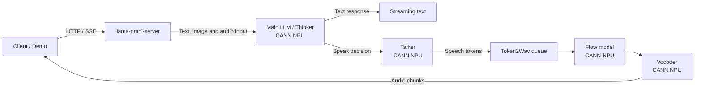

# MiniCPM-o 4.5 on Ascend 910C

> Deployment and inference optimization for the MiniCPM-o 4.5 omni-modal model
> on a single Ascend 910C NPU, built on `llama.cpp-omni`.

## Background

This project is part of a competition focused on deploying omni-modal large models on
Ascend computing platforms.

[MiniCPM-o 4.5](https://github.com/OpenBMB/MiniCPM-o) is a 9B-parameter on-device
omni-modal model jointly developed by ModelBest and Tsinghua University. Unlike
text-only LLMs, it accepts text, images, and audio as input, and can produce streaming
speech as output — all within a single request pipeline. A complete interaction
traverses the main language model, a Talker module, a Token2Wav pipeline (Flow +
Vocoder), and back to the client as audio chunks.

Getting the model to load on the NPU is only the first step. What actually matters
for real-time use:

- How long from user request to the first audio chunk;
- Whether Flow and Vocoder actually run on the CANN NPU;
- Whether model state and KV cache are correctly released across multiple turns;
- Whether text, speech, and streaming output can coexist stably in one server;
- Whether performance gains hold up under formal regression testing.

The initial version could complete inference, but parts of the speech generation
pipeline still ran on the CPU. Server lifecycle, TTS KV cache handling, and
streaming interfaces also had stability gaps. Our work targets the full
decode-to-speak critical path — device placement, cache reuse, thread lifecycle,
streaming output, and fault recovery — systematically, not one operator at a time.

## Why MiniCPM-o 4.5 Is Harder to Deploy

A text-only LLM pipeline typically looks like:

> Prompt → Prefill → Decode → Text

MiniCPM-o 4.5 adds several more stages:

> Multimodal Input → Main LLM → Talker → Flow → Vocoder → Streaming Audio

The pipeline spans Transformer decode, speech token generation, a conditional Flow
model, and a HiFi-GAN Vocoder. Different modules may use different runtimes, memory
buffers, and device backends. One module left on the CPU, or one Host-to-NPU sync
on the critical path, can directly inflate time-to-first-audio.

Our approach, therefore, is not just watching NPU utilization:

1. Break the request into stages and assign time budgets;
2. Audit the actual device placement of every tensor and module;
3. Validate every change with single-factor A/B experiments;
4. Verify service lifecycle with consecutive requests and fault injection;
5. Freeze source and binary, then re-run all gates.

## Competition Scope

This repository corresponds to the `llama.cpp-omni` optimization track: deploy
MiniCPM-o 4.5 stably on a single Ascend 910C and reduce per-audio-chunk
processing time on the streaming speech path.

The full competition evaluation also covers Daily-Omni accuracy, TTS-Seed metrics,
Video-MME metrics, official Demo usability, official per-audio-chunk RTF, and
accuracy delta relative to the framework's official baseline.

We have completed internal candidate freeze, reproducible binary build, stability
regression, and competition tooling preparation. The official Starter Kit, Benchmark
Harness, and Demo assets are not yet available. Current status:

- `FINAL_INTERNAL = PASS`
- `OFFICIAL_GATES = BLOCKED_BY_OFFICIAL_STARTER_KIT`
- `COMPETITION_COMPLETE = NOT_CLAIMED`

## What We Did

On the decode-to-speak critical path:

- Profiled the pipeline and confirmed that T2W (Flow + Vocoder) ran on CPU,
  accounting for 93% of time-to-first-audio — the Amdahl #1 bottleneck;
- Moved Flow and Vocoder from CPU to CANN NPU with zero source code changes
  (env-only backend switching);
- Introduced Static Prefix KV Cache: save the prefill result for the fixed
  system prefix on first request, load and skip prefill on subsequent requests;
- Converted the server from one-shot operation to a persistent service capable
  of handling consecutive requests, fixing drain-timeout-induced context invalidation;
- Corrected Token2Wav generation active accounting and drain predicates to
  eliminate cross-request polling races;
- Added TTS KV bounds guard: cap prefill token count to prevent context overflow
  during long requests;
- Fixed non-streaming text output (missing text field), an SSE crash (bad_alloc
  after worker exit), and multimodal prefill protocol issues (user_text handling
  and think-loop format for media_type=2);
- Validated stability through consecutive requests, disconnect recovery, fault
  injection, and frozen-binary regression (T6: 11/11 gates PASS, 0 cpu_fallback,
  0 cann_error);
- Built a complete evidence index (16 entries, including RAW_PERSISTED and
  REPORT_ONLY types) tracing every conclusion back to source, binary, config,
  and raw data.

One negative experiment (B6b: lowering the TTS chunk threshold to trigger
speech earlier) crossed zero in its CI and was explicitly **REJECTED**.

## Key Internal Results

> All numbers below are from internal A/B experiments. They are not official
> per-chunk RTF or end-to-end metrics. Full methodology and raw data in
> [`docs/F6_OPTIMIZATION_AND_RESULTS.md`](docs/F6_OPTIMIZATION_AND_RESULTS.md).

### Time-to-First-Audio (Request-to-first-WAV)

Initially, even with the main LLM offloaded to the NPU, Flow and Vocoder still
ran primarily on the CPU. From HTTP request arrival to the first WAV file, p50
latency was roughly **4.8 seconds**.

After migrating Flow and Vocoder to CANN (env-only, zero code change), this
dropped to **~0.9 seconds**.

| Metric | CPU T2W Baseline | CANN T2W Candidate | Change |
|---|---:|---:|---:|
| Request-to-first-WAV p50 | 4,798 ms | 894 ms | **−3,904 ms (−81.4%)** |
| CI95 (bootstrap, 10k resamples) | — | [−4,220, −3,732] ms | Excludes zero |
| Sample | 32 strict matched pairs | 32 strict matched pairs | Same binary/hardware/model/prompt |

The 32 pairs cover four case types (short text, long text, image, audio). Every
type saw a reduction of −79% to −83%, with zero CPU fallback and bit-identical
WAV output (16-bit PCM @24kHz).

"Request-to-first-WAV" measures wall-clock time from HTTP request arrival to
first WAV file mtime. It is an internal time-to-first-audio metric — not official
per-chunk RTF, not full-request E2E, not a vLLM-Omni result. Label:
`HISTORICAL_INTERNAL_RESULT`.

Evidence: [`docs/F6_PHASE2_STEP6_CANN_T2W_AB.md`](docs/F6_PHASE2_STEP6_CANN_T2W_AB.md) +
[`docs/f6-s13-closure/phase2/step6_cann_t2w_ab.json`](docs/f6-s13-closure/phase2/step6_cann_t2w_ab.json)

### Static Prefix KV Cache

Every request starts by prefill-ing a fixed system prompt and reference audio
embedding. Even when identical across requests, this cost ~206ms p50 each time.

We implemented prefix KV cache reuse: save the prefill result to a CANN buffer
on the first request, then load from cache and skip prefill on subsequent requests.

| Mode | Prefill p50 |
|---|---:|
| Prefix Cache MISS | 206 ms |
| Prefix Cache HIT | 85 ms |
| Reduction | 121 ms / 58.7% |
| Speedup | 2.4× |

All 30 strict matched pairs passed KV integrity checks (0 NOT_REUSABLE).
Confirmed 28/30 valid under frozen-binary T6 regression (2 pairs excluded due to
A_ERR, documented). The feature is opt-in via `OMNI_KV_CACHE_REUSE=1` (default off).

This is an internal prefill-stage result, not official audio-chunk RTF. Label:
`INTERNAL_PREFILL_STAGE_RESULT`.

Evidence: [`docs/tracking/f6_lifecycle/R13_CANONICAL_STATIC_PREFIX_AB_FINAL.md`](docs/tracking/f6_lifecycle/R13_CANONICAL_STATIC_PREFIX_AB_FINAL.md)

## System Pipeline

MiniCPM-o 4.5 does not generate audio waveforms directly from the main LLM.
The main model first completes multimodal understanding and text generation.
When the model decides to speak, the Talker module generates speech tokens,
which then pass through Token2Wav, Flow, and Vocoder to produce playable
audio chunks.



In the frozen candidate, main model weights, Flow, and Vocoder reside on CANN NPU.
Request control, some metadata, sampling, and final output assembly still run on
the Host CPU. `-ngl 999` should not be read as "zero CPU involvement."

A source-level audit of CANN device placement is available at
[`docs/audit/CANN_CPU_NPU_PLACEMENT_AUDIT.md`](docs/audit/CANN_CPU_NPU_PLACEMENT_AUDIT.md).

## Completed Optimizations

| Optimization | Problem | Approach | Docs |
|-------------|---------|----------|------|
| CANN T2W migration | Flow+Vocoder on CPU, 93% of time-to-first-audio | Env-only backend switch, zero code change | [link](docs/F6_PHASE2_STEP6_CANN_T2W_AB.md) |
| Static Prefix KV Cache | 206ms repeated prefill of fixed prefix | Save on first request, load on subsequent | [link](docs/tracking/f6_lifecycle/R13_CANONICAL_STATIC_PREFIX_AB_FINAL.md) |
| Persistent server lifecycle | Drain timeout invalidated context across turns | Fixed drain/timeout/ctx validity logic | [link](docs/tracking/F6_C6_PROFILE_LIFECYCLE_STATE_MACHINE.md) |
| Per-generation active accounting | Cross-request polling races | Per-generation active flag granularity | [link](docs/tracking/) |
| TTS KV bounds guard | n_past could reach n_ctx ceiling in long requests | Cap prefill at 256 tokens | [link](docs/tracking/) |
| Non-streaming text output | Missing text field in non-streaming response | Added text field | [link](docs/tracking/) |
| SSE crash fix | bad_alloc after worker exit (sink.done) | worker-once + sink.done guard | [link](docs/tracking/) |
| Multimodal prefill protocol | user_text loss + think-loop format in media_type=2 | Fixed prompt identity and format | [link](docs/f6-s13-closure/) |
| T6 integrated regression | Confirm all gates under frozen binary | 11/11 PASS | [link](docs/f6-s13-closure/phase2/T6_INTEGRATED_REGRESSION_REPORT.md) |

## Quick Start

```bash
export OMNI_T2W_DEVICE=cann-flow-only
export OMNI_VOC_DEVICE=gpu
export OMNI_KV_CACHE_REUSE=1
export ASCEND_RT_VISIBLE_DEVICES=0

./build/bin/llama-omni-server \
  -m "${MODEL_PATH}/MiniCPM-o-4_5-F16.gguf" \
  -ngl 999 -fa off -c 4096 -b 512 -ub 512 \
  --split-mode layer --device CANN0 \
  --no-mmap --mlock \
  --port 18093

curl -s "http://127.0.0.1:18093/health"
```

Detailed steps: [`docs/F6_QUICKSTART.md`](docs/F6_QUICKSTART.md) (Chinese).
Full reproduction: [`docs/F6_REPRODUCTION_GUIDE.md`](docs/F6_REPRODUCTION_GUIDE.md) (Chinese).

## Documentation

Most detailed documentation is in Chinese. Key entry points:

| You want to | Read |
|------------|------|
| Get started quickly | [`docs/F6_QUICKSTART.md`](docs/F6_QUICKSTART.md) |
| See full performance data | [`docs/F6_OPTIMIZATION_AND_RESULTS.md`](docs/F6_OPTIMIZATION_AND_RESULTS.md) |
| Understand the architecture | [`docs/F6_ARCHITECTURE.md`](docs/F6_ARCHITECTURE.md) |
| Review methodology and engineering principles | [`docs/F6_METHODOLOGY.md`](docs/F6_METHODOLOGY.md) |
| Reproduce all experiments | [`docs/F6_REPRODUCTION_GUIDE.md`](docs/F6_REPRODUCTION_GUIDE.md) |
| Verify evidence for every conclusion | [`docs/F6_EVIDENCE_INDEX.md`](docs/F6_EVIDENCE_INDEX.md) |
| Check competition status and limitations | [`docs/F6_LIMITATIONS_AND_OFFICIAL_GATES.md`](docs/F6_LIMITATIONS_AND_OFFICIAL_GATES.md) |
| Audit CANN device placement | [`docs/audit/CANN_CPU_NPU_PLACEMENT_AUDIT.md`](docs/audit/CANN_CPU_NPU_PLACEMENT_AUDIT.md) |
| Explore vLLM-Omni migration plans | [`docs/vllm-migration/`](docs/vllm-migration/) |

## Tags

| Tag | Description |
|-----|-------------|
| `f6-candidate-source-bdd4550` (→ `80c30cd`) | Frozen candidate source. Identical to original `bdd4550` except for removal of accidentally-committed msprof files (>100MB, exceeded GitHub limits). |
| `f6-handoff-7a979cf` (→ `7a979cf`) | Current handoff HEAD with full documentation, audit, tooling, and this README. |

The `main` branch tracks `7a979cf` (latest handoff HEAD).

## Known Limitations

### Official Evaluations — All Pending

Daily-Omni accuracy, TTS-Seed, Video-MME, Demo verification, and per-chunk RTF
are all `NOT_RUN`, blocked by the official Starter Kit not yet being available.
Our internal Daily-Omni pilot covered only 6/6 server-side gates (connectivity),
not a full accuracy evaluation.

### CANN Device Placement — Statically Confirmed, Runtime Pending

We have completed a thorough source-level audit of CANN backend device placement:
which ops support CANN, the offload trigger condition (`ne[1] >= 32`), how the
scheduler assigns weight tensors, and where sync/copy calls occur. These static
checks are all **PASS**.

However, harder evidence — CANN profiler timelines, backend allocation logs, and
per-chunk CPU/NPU breakdowns — has not yet been collected. Therefore
`MAIN_LLM_RUNTIME_PLACEMENT = PARTIAL`, and `CPU_PER_CHUNK_CRITICAL_PATH`,
`GRAPH_SPLIT_RUNTIME_COUNT`, `STREAM_SYNC_RUNTIME_COST`, and `D2H_COST` are
marked `NOT_MEASURED` or `TO_MEASURED`.

Additionally, `caps.async = false` on Ascend 910C (no general-purpose async
compute pipeline in CANN backend), and the Flash Attention extension only
covers F16 dtype.

Full analysis: [`docs/F6_LIMITATIONS_AND_OFFICIAL_GATES.md`](docs/F6_LIMITATIONS_AND_OFFICIAL_GATES.md)
(Chinese).

## What's Not in This Repo

Model weights (MiniCPM-o-4_5-F16.gguf, ~16 GB), build artifacts, audio profiling
data, demo videos, and official benchmark results are not included. Model SHA256
verification: [`docs/F6_QUICKSTART.md`](docs/F6_QUICKSTART.md).

## Upstream & License

This project is based on [llama.cpp](https://github.com/ggml-org/llama.cpp) and
[llama.cpp-omni](https://github.com/ggml-org/llama.cpp-omni), retaining the
upstream MIT License ([`LICENSE`](LICENSE)).

Upstream README preserved at [`docs/upstream/LLAMA_CPP_OMNI_README.md`](docs/upstream/LLAMA_CPP_OMNI_README.md).
Model: [MiniCPM-o 4.5](https://github.com/OpenBMB/MiniCPM-o) by ModelBest &
Tsinghua University.

---

> **INTERNAL_COMPETITION_HANDOFF** — This is an internal competition handoff
> repository. It does not represent an official final submission.
> `COMPETITION_COMPLETE = NOT_CLAIMED`.
