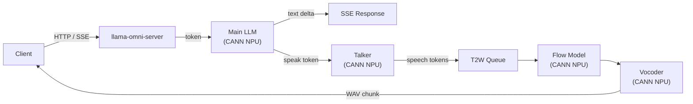

# MiniCPM-o 4.5 on Ascend 910C

本仓库是 **MiniCPM-o 4.5 全双工语音对话模型** 在单卡 Ascend 910C 上的工程优化与比赛交付项目。
我们在 [llama.cpp-omni](https://github.com/ggml-org/llama.cpp) 的基础上完成了 NPU 设备迁移、
流式语音链路调优、服务生命周期修复和稳定性验证，将首次语音响应延迟降低了 **81.4%**。

目前项目处于 **内部冻结交接状态** —— 源码冻结、二进制可复现、全部门槛测试通过，
等待官方 Starter Kit 到达后进入正式评测。

上游原始 README 保存在 [`docs/upstream/LLAMA_CPP_OMNI_README.md`](docs/upstream/LLAMA_CPP_OMNI_README.md)。

---

## 背景

### 模型

[MiniCPM-o 4.5](https://github.com/OpenBMB/MiniCPM-o) 是面壁智能（ModelBest）与清华大学联合发布的 9B 参数端侧全模态大模型，
支持文本、图像、语音输入和流式语音输出，能在消费级硬件上跑通完整的"听—想—说"实时对话。

它的语音链路分为几段：主 LLM 听懂问题、生成回答 → Talker 模块在 `<|speak|>` token 处触发 TTS
→ Flow 网络把 speech token 转成 mel 频谱 → Vocoder 再转成 PCM 波形 → 客户端播放。
在纯 CPU 环境下，从用户发完请求到第一个音频 chunk 返回大约需要 **4.8 秒**，
其中 93% 的时间耗在 Flow + Vocoder 两个模型上。

### 比赛

本项目参加了某国产硬件推理优化比赛，目标是在 Ascend 910C NPU 上把这套链路跑通并尽可能加速，
同时保证服务稳定、文档完整、结果可复现。我们的提交策略是：**只做 env-only 的设备配置切换，
不碰模型权重和推理逻辑**，靠 profiling 找到瓶颈，用单因素 A/B 验证每一项改动，
所有的优化决策都有 Amdahl 排序和严格配对实验支撑。

### 硬件

| 项 | 规格 |
|---|------|
| NPU | Ascend 910C dual-die |
| CANN | 9.1.0-beta.1 |
| 模式 | 单卡推理（-ngl 999, split-mode layer） |
| 精度 | FP16（模型 + KV cache） |

---

## 当前状态

源码已冻结在 commit `bdd4550`（仓库中对应的 tag 是 `f6-candidate-source-bdd4550`，指向 `80c30cd`）。
该 commit 的二进制可以两次编译验证一致（server `db258375` / libomni `c4b16937`），
且通过了全部 11 项集成回归测试。安全审计已跑完，仓库中不含任何凭据或个人路径。

官方评测需要在比赛组委会提供的 Starter Kit 下运行，目前工具包尚未到达，因此所有五个官方 Gate
（Daily-Omni 准确率、TTS-Seed 指标、Video-MME 指标、Demo 验收、per-chunk RTF）均处于
`NOT_RUN / BLOCKED_BY_OFFICIAL_STARTER_KIT` 状态。`COMPETITION_COMPLETE=NOT_CLAIMED`。

---

## 主要结果

> 下面的数字全部来自 **内部 A/B 实验**，不等同于官方 per-chunk RTF 或完整端到端指标。
> 完整实验口径和原始数据见 [`docs/F6_OPTIMIZATION_AND_RESULTS.md`](docs/F6_OPTIMIZATION_AND_RESULTS.md)。

### Request → 首个音频 chunk（W0）

这是用户体感最强的延迟：从 HTTP 请求到达服务器，到第一个 WAV 文件落盘。
我们把 Flow 和 Vocoder 两个模型从 CPU 搬到 CANN NPU，不源码改动、不加一行 C++，
只靠两个环境变量切换后端：

```bash
OMNI_T2W_DEVICE=cann-flow-only
OMNI_VOC_DEVICE=gpu
```

| 指标 | Baseline（CPU T2W） | Candidate（CANN T2W） | 变化 |
|---|---:|---:|---:|
| Request→W0 p50 | 4,798 ms | 894 ms | **−3,904 ms (−81.4%)** |
| CI95 (bootstrap, 10k resamples) | — | [−4,220, −3,732] ms | 不含 0 |
| 样本 | 32 strict matched pairs | 同 32 对 | 同 binary / 硬件 / 模型 / prompt |

32 对实验中涵盖了 4 种典型场景（短文本、长文本、带图片、带音频），每种的降幅都在 −79% 到 −83% 之间，
没有 CPU fallback，没有 WAV 质量退化（16-bit PCM @24kHz 逐 bit 校验）。

> **标签**: `HISTORICAL_INTERNAL_RESULT` — 这是 Request→W0 p50 的配对 A/B 结果，不是官方 chunk RTF，
> 不是完整请求 E2E 指标，不是 vLLM 的结果。

证据: [`docs/F6_PHASE2_STEP6_CANN_T2W_AB.md`](docs/F6_PHASE2_STEP6_CANN_T2W_AB.md) +
[`docs/f6-s13-closure/phase2/step6_cann_t2w_ab.json`](docs/f6-s13-closure/phase2/step6_cann_t2w_ab.json)

### Static Prefix KV Cache

每次请求都会在开头 prefill 一段固定的 system prompt + reference audio embedding，
这部分即使内容不变也要重新算一遍，p50 耗时约 206ms。
我们实现了 prefix KV cache 复用机制：首次请求把 prefill 结果保存到 CANN buffer，
后续请求直接从 cache 加载、跳过 prefill。

| 指标 | 无 cache（MISS） | 有 cache（HIT） | 变化 |
|---|---:|---:|---:|
| Prefill p50 | 206 ms | 85 ms | **−121 ms (−58.7%, 2.4× 加速)** |
| 样本 | 30 strict matched pairs | 30 strict matched pairs | 同 binary / 硬件 / 模型 / prompt |
| CI95 (bootstrap) | — | [37, 249] ms | 不含 0 |

30 对实验全部通过 KV 完整性校验，0 次 NOT_REUSABLE。在冻结 binary 的 T6 回归测试中进一步确认了
28/30 有效（2 对因 A_ERR 被排除，文档已记录）。这项优化默认关闭，
通过 `OMNI_KV_CACHE_REUSE=1` 按需开启。

> **标签**: `INTERNAL_PREFILL_STAGE_RESULT` — 这是 Prefill 阶段的内部结果，不是官方 chunk RTF。

证据: [`docs/tracking/f6_lifecycle/R13_CANONICAL_STATIC_PREFIX_AB_FINAL.md`](docs/tracking/f6_lifecycle/R13_CANONICAL_STATIC_PREFIX_AB_FINAL.md)

---

## 系统链路



请求进来后，主 LLM 在 CANN NPU 上逐 token 解码。遇到 `<|speak|>` 时 Talker 接管，
生成 speech token 送入 T2W 队列，依次过 Flow（DiT transformer: token → mel spectrogram）
和 Vocoder（HiFi-GAN: mel → 16-bit PCM @24kHz），产出的 WAV chunk 通过 SSE 推回客户端。
Sampler、Tokenizer 和 HTTP 响应组装等控制面逻辑跑在 Host CPU 上。

CANN 设备放置的源码级审计见 [`docs/audit/CANN_CPU_NPU_PLACEMENT_AUDIT.md`](docs/audit/CANN_CPU_NPU_PLACEMENT_AUDIT.md)。

---

## 完整优化清单

共 9 项改动，全部在源码冻结的 bdd4550 上验证通过，T6 集成回归 11/11 PASS。

| 优化 | 问题 | 方案 | 文档 |
|------|------|------|------|
| CANN T2W 迁移 | Flow+Vocoder 在 CPU，占 W0 的 93% | env-only 设备切换，零代码修改 | [link](docs/F6_PHASE2_STEP6_CANN_T2W_AB.md) |
| Static Prefix KV Cache | 每次请求重复 prefill 固定前缀（206ms） | 首次 save → 后续 load，跳过 prefill | [link](docs/tracking/f6_lifecycle/R13_CANONICAL_STATIC_PREFIX_AB_FINAL.md) |
| 持久服务生命周期 | drain timeout 导致 context 失效，后续请求不可用 | 修复 drain / timeout / ctx validity 逻辑 | [link](docs/tracking/F6_C6_PROFILE_LIFECYCLE_STATE_MACHINE.md) |
| Per-generation active 计数 | 跨请求的 polling 判断竞争 | 改为 per-generation 粒度的 active 标记 | [link](docs/tracking/) |
| TTS KV bounds guard | 单次请求内 n_past 可能触及 n_ctx 上限 | prefill 阶段 cap prefill_with_emb_tts at 256 | [link](docs/tracking/) |
| 非流式 text 输出修复 | 非流式 decode 响应中缺少 text 字段 | 补齐 text 字段到非流式响应 | [link](docs/tracking/) |
| SSE crash 修复 | worker 退出后 sink.done 触发 bad_alloc | worker-once + sink.done guard | [link](docs/tracking/) |
| 多模态 prefill 协议修复 | media_type=2 场景下 user_text 丢失 + think-loop 格式错误 | 修正 prompt 身份与格式 | [link](docs/f6-s13-closure/) |
| T6 集成回归 | 需要确认冻结 binary 下的所有 Gate | 11/11 gates, 0 cpu_fallback, 0 cann_error | [link](docs/f6-s13-closure/phase2/T6_INTEGRATED_REGRESSION_REPORT.md) |

此外，B6b（调低 TTS chunk 阈值试图更早触发 TTS）做了负实验，CI 跨 0 被 **REJECT**。

---

## 快速开始

```bash
# 环境变量
export OMNI_T2W_DEVICE=cann-flow-only
export OMNI_VOC_DEVICE=gpu
export OMNI_KV_CACHE_REUSE=1
export ASCEND_RT_VISIBLE_DEVICES=0

# 启动 server
./build/bin/llama-omni-server \
  -m "${MODEL_PATH}/MiniCPM-o-4_5-F16.gguf" \
  -ngl 999 -fa off -c 4096 -b 512 -ub 512 \
  --split-mode layer --device CANN0 \
  --no-mmap --mlock \
  --port 18093

# 健康检查
curl -s "http://127.0.0.1:18093/health"

# 冒烟测试：发送 OAI chat/completions 请求
# 参考 scripts/f6_phase3_t6_integrated_regression.py
```

详细步骤见 [`docs/F6_QUICKSTART.md`](docs/F6_QUICKSTART.md)，完整复现流程见 [`docs/F6_REPRODUCTION_GUIDE.md`](docs/F6_REPRODUCTION_GUIDE.md)。

---

## 文档导航

| 目标 | 时间 | 文档 |
|------|------|------|
| 项目全貌 | 5 min | [`docs/F6_README.md`](docs/F6_README.md) |
| 快速启动 + 优化结果 | 15 min | [`docs/F6_QUICKSTART.md`](docs/F6_QUICKSTART.md), [`docs/F6_OPTIMIZATION_AND_RESULTS.md`](docs/F6_OPTIMIZATION_AND_RESULTS.md) |
| 架构 + 方法论 | 30 min | [`docs/F6_ARCHITECTURE.md`](docs/F6_ARCHITECTURE.md), [`docs/F6_METHODOLOGY.md`](docs/F6_METHODOLOGY.md) |
| 完整复现 | 1-2 h | [`docs/F6_REPRODUCTION_GUIDE.md`](docs/F6_REPRODUCTION_GUIDE.md), [`docs/F6_EVIDENCE_INDEX.md`](docs/F6_EVIDENCE_INDEX.md) |
| 比赛状态与限制 | 10 min | [`docs/F6_LIMITATIONS_AND_OFFICIAL_GATES.md`](docs/F6_LIMITATIONS_AND_OFFICIAL_GATES.md), [`docs/competition-submission/`](docs/competition-submission/) |
| CANN 设备放置审计 | 30 min | [`docs/audit/CANN_CPU_NPU_PLACEMENT_AUDIT.md`](docs/audit/CANN_CPU_NPU_PLACEMENT_AUDIT.md) |
| vLLM-Omni 迁移 | 30 min | [`docs/vllm-migration/`](docs/vllm-migration/) |

---

## 仓库结构

```text
src/                  llama.cpp 核心（llama.cpp, context, kv-cache 等）
tools/server/         HTTP/SSE server（llama-omni-server）
tools/omni/           Omni 推理引擎（talker, token2wav, prefill 协议）
ggml/src/ggml-cann/   CANN NPU backend（Ascend 910C 适配）
docs/                 项目文档、审计、证据、追踪记录
submission/           比赛提交脚本与配置
release/              交付归档（tarballs, SHA256SUMS）
```

---

## 版本与 Tag

| Tag | 指向 | 说明 |
|-----|------|------|
| `f6-candidate-source-bdd4550` | `80c30cd` | 冻结候选源码。与原始 `bdd4550` 源码完全一致，仅移除了 git history 中误提交的 msprof 大文件（>100MB，超出 GitHub 限制） |
| `f6-handoff-9b28c6e` | `9b28c6e` | 当前交接 HEAD（含完整的文档、审计、提交工具链和本 README） |
| `f6-handoff-5df2add` | `5df2add` | 前一版交接 tag（README 重写前） |

`main` 分支指向 `9b28c6e`（最新交接 HEAD）。`perf/f6-decode-to-speak` 分支指向 `5df2add`（文档版 HEAD）。

---

## 已知限制

### 官方评测 —— 全部待运行

Daily-Omni 准确率、TTS-Seed 指标、Video-MME 指标、Demo 验收和 per-chunk RTF
这五项官方评测目前都 **未运行**，原因是比赛官方 Starter Kit 尚未到达。
我们自己的内部 Daily-Omni pilot 只跑了 6/6 server 端 gates（功能连通性），不是全量准确率评测。

### CANN 设备放置 —— 静态已确认，运行时待测

源码层面我们已经完整审计了 CANN backend 的设备放置逻辑：
哪些 op 支持 CANN、offload 的触发条件（`ne[1] >= 32`）、scheduler 如何分配 weight tensor、
sync/copy 的调用点在哪里。这些静态分析是 **PASS** 的。

但更硬的证据——CANN profiler timeline、backend 分配日志、per-chunk 的 CPU/NPU 逐段耗时分解——
还没有跑。因此 `MAIN_LLM_RUNTIME_PLACEMENT = PARTIAL`，
`CPU_PER_CHUNK_CRITICAL_PATH`、`GRAPH_SPLIT_RUNTIME_COUNT`、`STREAM_SYNC_RUNTIME_COST`、`D2H_COST`
四项标记为 `NOT_MEASURED` 或 `TO_MEASURE`。

另外 Ascend 910C 上 `caps.async = false`，这意味着 CANN backend 不支持通用异步计算流水线，
Flash Attention 的扩展实现也只覆盖了 F16 dtype。

完整分析见 [`docs/F6_LIMITATIONS_AND_OFFICIAL_GATES.md`](docs/F6_LIMITATIONS_AND_OFFICIAL_GATES.md)。

---

## 不包含的内容

模型权重（MiniCPM-o-4_5-F16.gguf, ~16 GB）、编译产物（build/）、音频 profiling 数据、
Demo 视频和官方 Benchmark 结果均 **不在本仓库中**。
模型 SHA256 验证方式见 [`docs/F6_QUICKSTART.md`](docs/F6_QUICKSTART.md)。

---

## 上游与许可证

本项目基于 [llama.cpp](https://github.com/ggml-org/llama.cpp) 和
[llama.cpp-omni](https://github.com/ggml-org/llama.cpp-omni)，
保留上游 MIT License（[`LICENSE`](LICENSE)）。

上游原始 README: [`docs/upstream/LLAMA_CPP_OMNI_README.md`](docs/upstream/LLAMA_CPP_OMNI_README.md)。
模型: [MiniCPM-o 4.5](https://github.com/OpenBMB/MiniCPM-o) by ModelBest & Tsinghua University。

---

> **INTERNAL_COMPETITION_HANDOFF** — 本仓库为内部比赛交接状态，不代表官方最终提交。
> `COMPETITION_COMPLETE=NOT_CLAIMED`。
