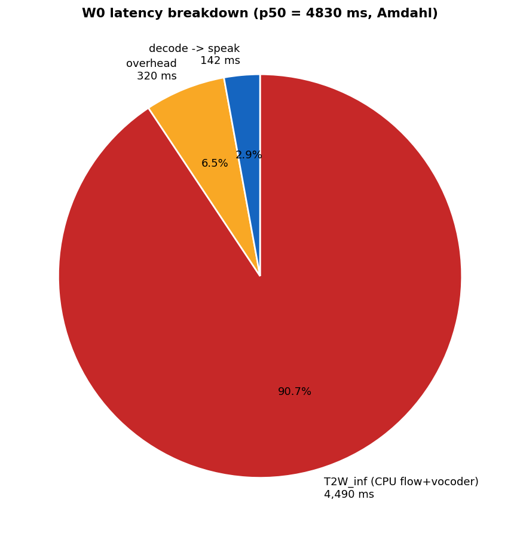
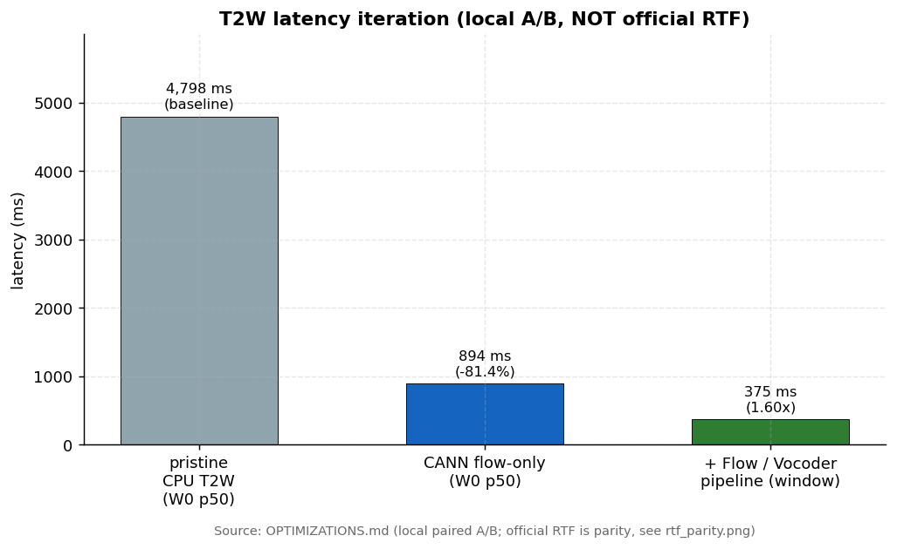
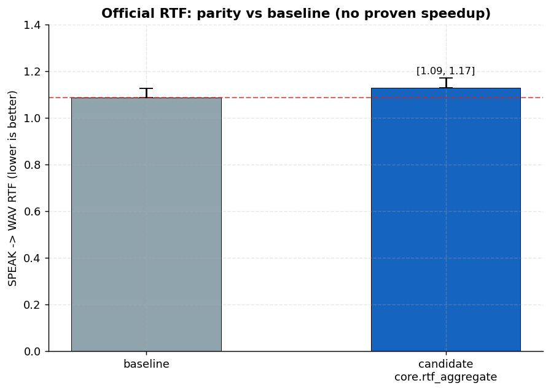
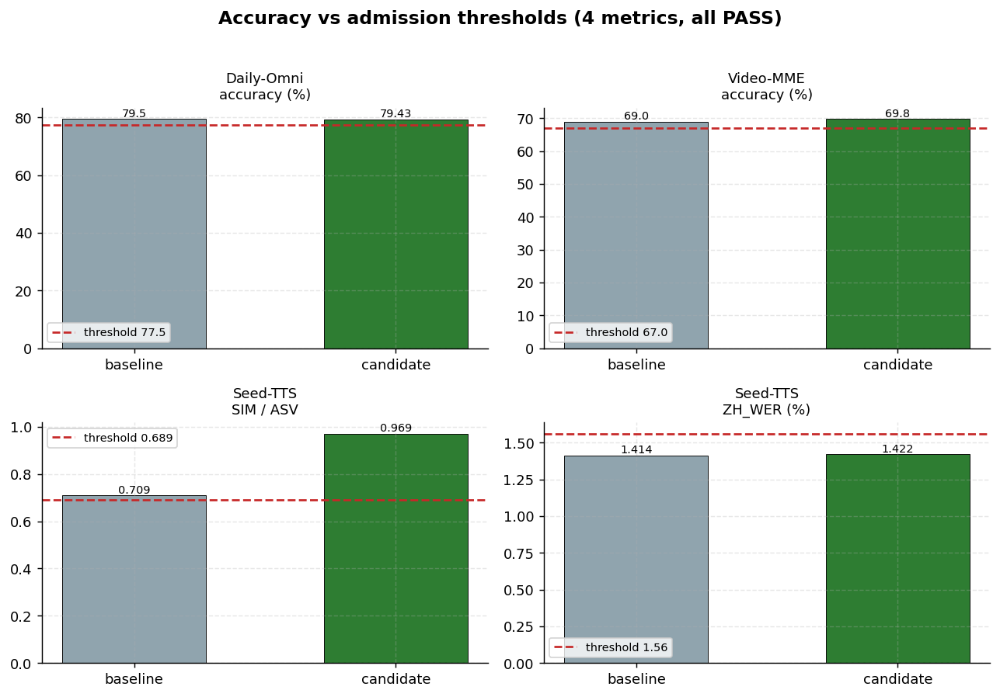

<div align="center">


# MiniCPM-o 4.5

### From DSpark Training to Ascend 910C Runtime Optimisation

*A cross-platform model-to-system project across NVIDIA B300-class GPUs and Huawei Ascend 910C.*

**English** · [简体中文](README.zh-CN.md)

[](#8-the-rtf-optimisation-chain)
[](#1--objective--system-boundary)
[](#9--accuracy--environment-isolation)
[](#5--speculative-decoding--workload-economics)
[](https://github.com/Phoenix3334/minicpmo45-ascend-private/tree/docs/tilelang-tutorial)
[](https://www.hiascend.com/)
[](https://github.com/tc-mb/llama.cpp-omni)
[](LICENSE)

**Topics:** [llama-cpp](https://github.com/topics/llama-cpp) · [minicpm](https://github.com/topics/minicpm) · [tilelang](https://github.com/topics/tilelang) · [deepspec](https://github.com/topics/deepspec) · [dspark](https://github.com/topics/dspark) · [speculative-decoding](https://github.com/topics/speculative-decoding) · [ascend](https://github.com/topics/ascend) · [cann](https://github.com/topics/cann)

**Status: submitted (2026-08-31).** Core RTF **0.6754 → 0.4829** under an identical harness ·
all four accuracy gates passed · speculative decoding kept as a standalone text-domain asset.

> ⚠️ This `main` branch is the **project introduction**, not the delivery branch.
> Final code lives on `competition/final-ascend-track-a` (frozen runtime `fd3dd36`) —
> see [Repository Navigation](#-repository-navigation).

**New here?** 📊 [Scoreboard](#results-scoreboard) · 🗺️ [Repository map](#-repository-navigation) · 📅 [Timeline](#-timeline-with-git-anchors)

**by [@Phoenix3334](https://github.com/Phoenix3334)（repo owner）& Jimmy Lau（佳明 · liujiaming@zju.edu.cn）**

</div>

---

## The one lesson

> **Model-side acceptance, standalone speculative speedup, and real-time duplex performance
> are three separate endpoints — and must be measured independently.**
> A win on any one of them does not extrapolate to the others. This project's numbers are
> reported with that boundary drawn explicitly, every time.

---

## Project lifecycle at a glance

```text
┌───────────────────────────  B300 · training  ───────────────────────────┐
│                                                                         │
│   4,197 real multimodal samples ──▶ frozen target forward               │
│   (Daily-Omni · Video-MME · Seed-TTS)        │                          │
│                                              ▼                          │
│                        hidden-state cache — 98.21 GiB · 2.15M tokens    │
│                                              │                          │
│                                              ▼                          │
│                     DP8 DSpark draft training — 150 steps, zero failures│
└──────────────────────────────────────────────┬──────────────────────────┘
                                               ▼
                          Stage11 checkpoint ──▶ controlled acceptance eval
                                               │
┌──────────────────────────  Ascend 910C · serving  ──────────────────────┐
│                                                                         │
│   GGUF swap + mixed precision (1.85 GB) ──▶ llama.cpp-omni full duplex  │
│                          │                          │                   │
│                          ▼                          ▼                   │
│                 msprof / host profiling ──▶ kernel & runtime optimisation│
│                          └───────────┬──────────────┘                   │
│                                      ▼                                  │
│                   end-to-end RTF validation ──▶ 0.4829                  │
└─────────────────────────────────────────────────────────────────────────┘
```

## Results scoreboard

| Dimension | Result | Contract |
|---|:---:|---|
| **End-to-end RTF** | **0.4829 ± 0.0161** (recheck 0.4840 ± 0.0125) | paired local baseline 0.6754 ± 0.0152 → **−28.5 %**; public 1.087 is directional only (−55.6 %) |
| **Accuracy (4 gates)** | VideoMME **69.8** · Daily-Omni **79.43** · TTS SIM **0.969** · TTS WER **1.422 %** | required ≥67.0 / ≥77.5 / ≥0.689 / ≤1.56 % — **4/4 PASS** |
| **Speculative decoding** | text k=2 **1.87×** · k=3 1.80× · k=7 1.75× · 15-frame MM 1.49× | standalone benchmark; **disabled** in final RTS config (short chunks can't amortise) |
| **Kernel fusion** | QK-norm+RoPE **+66 %** decode (0.47→0.78 tok/s) · RMSNorm +25 % (stacked +55–65 %) | TileLang-Ascend AOT, bitwise-equal output |
| **Launch tax** | host launches **18,214 → 1,301** | VPM patch-mm + operator fusion + ACL graph |
| **Training** | 5-layer DSpark draft · 4,197 samples · DP8 × 150 steps, zero NaN/OOM/NCCL | accept length 3.49 → 3.86 (+10.6 %) |

---

## Table of contents

1. [Objective & system boundary](#1--objective--system-boundary)
2. [Training side: DSpark draft on B300](#2--training-side-dspark-draft-on-b300)
3. [Draft quality: controlled acceptance](#3--draft-quality-controlled-acceptance)
4. [Cross-platform artifact: B300 → 910C](#4--cross-platform-artifact-b300--910c)
5. [Speculative decoding & workload economics](#5--speculative-decoding--workload-economics)
6. [Profiling on Ascend 910C](#6--profiling-on-ascend-910c)
7. [TileLang, launch tax & kernel fusion](#7-tilelang-launch-tax--kernel-fusion)
8. [The RTF optimisation chain](#8-the-rtf-optimisation-chain)
9. [Accuracy & environment isolation](#9--accuracy--environment-isolation)
10. [Rejected routes](#10--rejected-routes)
11. [Engineering takeaways](#11--engineering-takeaways)
12. [Repository navigation](#-repository-navigation)
13. [Reproduction protocol](#13--reproduction-protocol)
14. [Timeline with git anchors](#-timeline-with-git-anchors)

---

## 1 · Objective & system boundary

This project comes from an omnimodal-model deployment competition on Ascend hardware
(**llama.cpp-omni subtrack**). Five gates, in order:

```text
framework & environment runs
        ↓
benchmark accuracy drop ≤ 2 pp        ── admission gate
        ↓
official demo end-to-end usable       ── admission gate
        ↓
per-audio-chunk RTF                   ── ranking metric
        ↓
reproduction in the organizer's environment
```

Accuracy and demo usability are **admission conditions** — only after passing both does an
optimisation enter performance evaluation.

**Stack:**

| Layer | Component |
|---|---|
| Application | full-duplex MiniCPM-o serving (streaming video/audio in, streaming speech out) |
| Runtime | llama.cpp-omni (fork of ggml-org/llama.cpp) |
| Backend | ggml-cann + ACLNN / CANN (serving baseline 8.5.0.alpha002; TileLang kernel line 9.1.0-beta.1) |
| Kernels | TileLang-Ascend AOT shared objects (pure C ABI, 15.3 µs/call single-core) |
| Graphs | ACL graph capture/replay where validated |
| Hardware | 1× Ascend 910C (dual-die) — **all perf/accuracy runs pin one die** (cross-die produced invalid numerics, rejected) |

### The chunk pipeline

```text
video / audio stream
   └─▶ VPM vision encoder ──▶ Thinker prefill + decode ──▶ Talker / TTS tokens ──▶ token2wav ──▶ WAV
          T_vis                     T_pre   T_dec               T_tts               T_wav
```

A duplex chunk costs `T_chunk = T_vis + T_pre + T_dec + T_tts + T_wav`; the serving objective is

```text
RTF = T_chunk / D_audio          (lower = more real-time headroom)
```

**System-boundary awareness:** a 2× faster isolated kernel has negligible RTF impact when its
stage contributes only a small fraction of the pipeline — this project paid real tuition to
learn that (see the Amdahl case in §7).

### Measurement contract

Final comparisons use the **same 120 s duplex video, 37 chunks, identical timing boundaries,
seeds 1001–1004, cold model loading excluded**. The paired local baseline is
0.6754 ± 0.0152; the final configuration is 0.4829 ± 0.0161. The public official RTF 1.087
is kept **only as a directional reference** — it was produced under a different harness, and
the two are always reported separately, never mixed.

---

## 2 · Training side: DSpark draft on B300

The target MiniCPM-o model is **frozen**. The trainable object is a **5-layer DSpark draft**
learning from target hidden states at layers `[1, 9, 17, 25, 33]`; concatenating five
4096-dim states gives a **20,480-dim target feature per token**.

### Real data, offline target cache

| Source | Samples |
|---|---:|
| Daily-Omni | 1,197 |
| Video-MME | 1,500 |
| Seed-TTS EN | 1,088 |
| Seed-TTS ZH | 412 |
| **Total** | **4,197** |

A frozen target forward ran **once** to build the teacher cache (instead of repeating the
target model inside every training step):

> 4,197/4,197 successful · 2,145,260 cached tokens · 10 shards · **98.21 GiB** · 113.8 min ·
> zero failed, zero overlong. Hidden states in BF16; rollout tokens via FP16 target inference
> (64 generated tokens, max length 2048).

### Architecture & training contract

| Item | Configuration |
|---|---|
| Draft layers | 5 |
| Block size | 7 proposed tokens/step |
| Target layers | [1, 9, 17, 25, 33] |
| Hidden size | 4096 |
| Anchors / Markov rank | 512 / 256 |
| Loss | CE 0.1 + L1 0.9, decay γ = 8 |
| Precision / LR | BF16 / 3×10⁻⁶ |

**DP8 batch arithmetic** — local batch 1 × DP world size 8 × grad accumulation 4 =
**effective global batch 32**; one epoch ≈ 131.2 optimizer steps, and training is driven by
`max_train_steps=150` (the tail enters a second pass through the data).
The formal run completed **150 steps with zero NaN / Inf / OOM / NCCL failure**,
checkpointing every 25 steps.

<details><summary><b>Representative step records</b> (all values finite)</summary>

| Step | Loss | LR | Step time (s) |
|---:|---:|---:|---:|
| 25 | 1.0065 | 2.89×10⁻⁶ | 0.96 |
| 50 | 1.1815 | 2.38×10⁻⁶ | 0.63 |
| 75 | 1.1186 | 1.62×10⁻⁶ | 0.62 |
| 100 | 1.3071 | 8.18×10⁻⁷ | 0.63 |
| 125 | 1.3391 | 2.21×10⁻⁷ | 0.63 |
| 150 | 0.8430 | 0 | 0.63 |

Logged gradient-norm values were much larger than the configured clip threshold of 1.0;
because the logger's position relative to clipping was not verified in the pinned source,
the observation is treated conservatively rather than read as instability.

</details>

### Checkpoint semantics & model lineage

`step_150` holds ≈ **2.369 B parameters** (4.41 GiB `model.safetensors`). The eight
rank-local `training_state.rank*.pt` files are **resume state, not eight different models** —
under no-shard data parallelism every rank holds a full synchronized replica, and these files
are excluded from inference export.

```text
Stage10 weights ──strict warmstart──▶ Stage11 training (optimizer/scheduler recreated)
                                   ──▶ 150-step formal run ──▶ formal Draft artifact
```

**The submitted Draft weights come from B300 Stage11.** The 910C-side fine-tune is a
method-validation and acceptance-repair asset, deliberately excluded from the main lineage.

---

## 3 · Draft quality: controlled acceptance

Stage10 vs Stage11 over **644 text samples** (GSM8K / HumanEval / MT-Bench / Alpaca), with
target model, tokenizer, generation config, seed, world size and sample identity controlled;
prompt SHA256 multisets asserted equal:

| Metric | Stage10 | Stage11 | Δ |
|---|---:|---:|---:|
| Avg. accept length | 3.4923 | **3.8620** | +0.3697 |
| Overall accept rate | 0.4388 | **0.4854** | +0.0466 |
| accept@4 | 0.2164 | **0.2906** | +0.0742 |
| accept@5 | 0.1461 | **0.2348** | +0.0886 |
| accept@6 | 0.0954 | **0.1895** | +0.0941 |
| Conf. abs. error | 0.0516 | 0.0511 | −0.0005 |

The gain grows toward the tail of the 7-token block while accept@0 barely moves — exactly
the signal speculative drafting wants: **the model got better at sustaining a correct block,
not merely at guessing the first draft token.**

> **Evidence boundary.** Acceptance improvement is *not* a TPS claim. Serving speed also
> depends on draft cost, verification batch cost, request length and runtime scheduling —
> which is why standalone speculative speed and full-duplex RTF are measured separately (§5).

---

## 4 · Cross-platform artifact: B300 → 910C

The Stage11 artifact was converted for the Ascend runtime **without changing its lineage**.
A generic exporter was insufficient — draft-specific fields and tensor semantics had to be
preserved — so the path is a **custom safetensors→GGUF payload swap**:

```text
Stage11 BF16 safetensors            (formal B300 artifact)
   └─▶ draft-aware GGUF swap        (preserves DSpark metadata & layout)
        └─▶ mixed Q8_0 / BF16 / F32 (deployable size: 1.85 GB)
             └─▶ parity checks      (header/tensor integrity + acceptance A/B)
```

Only selected linear tensors were quantized; numerically sensitive norms/biases stayed F32;
the Markov path stayed unquantized after all-Q8 backend failures. Across three prompt checks,
BF16 and the mixed artifact produced **bit-identical acceptance**.
**No quantization speedup is claimed** — measured Q8 and BF16 throughput were comparable
on this backend.

### Runtime correctness contracts

*"The model loads" ≠ "the speculative path works."* Integration required fixing three
contracts:

1. the draft must consume the **current** KV position, not a stale `n_past`;
2. **all** additionally accepted tokens must be returned to the target stream, not only the first;
3. duplex prefix, hidden-state and listen-flush hooks must stay aligned across the speculative path.

A numerically correct operator can still fail once placed back into the concurrent runtime —
stale KV, dropped accepted tokens, reused buffers, stream races and hidden environment state
make **runtime semantics a first-class performance variable**.

---

## 5 · Speculative decoding & workload economics

On an independent text benchmark, measured draft cost was ≈ **1.11 ms/token — about 1/28 of
target cost**:

| Scenario | Measured speedup |
|---|:---:|
| Text, k=2 | **1.87×** |
| Text, k=3 | 1.80× |
| Text, k=7 | 1.75× |
| 15-frame multimodal | 1.49× |

**The real-time duplex path produced the opposite decision:**

| Metric | Draft off | Draft on |
|---|---:|---:|
| Core RTF | 3.979 | **4.460** (≈ +12 % worse) |
| LLM decode | 0.132 | 0.338 (2.6× slower) |
| Output continuity | coherent | fragmented |

Short chunks decode only a few tokens at a time — draft forward, verification and KV
synchronisation cannot be amortised. **The final RTS configuration disables thinker-side
speculation while keeping the speculative subsystem as a standalone long-form/text asset.**

> **Three endpoints that must not be mixed**
> ① acceptance — model-side draft quality ② 1.87× — standalone speculative runtime
> ③ 0.4829 — final full-duplex result with thinker speculation disabled.

---

## 6 · Profiling on Ascend 910C

Optimisation starts from **measured time distribution**, not from a predetermined kernel target.

| Profile component | Share |
|---|---:|
| Main LLM forward (msprof) | 26.8 % |
| KV ScatterUpdate | 19.4 % |
| F32↔F16 casts | 13.6 % |
| LM head | 0.65 % |
| Logits synchronisation (of decode) | 48 % |
| Embedding synchronisation (of decode) | 32 % |
| llama_decode body (of decode) | 17 % |
| Allocation (of decode) | ~0.1 % |

TTS-side: ≈ 3.3 ms/token (66 % of per-token time) in synchronisation.
Token2wav-side: **vocoder im2col ≈ 85 % of the vocoder path**.

These decompositions refuted two attractive-but-wrong directions: allocation was not the
decode bottleneck, and the LM head was too small to justify a head-only rewrite.
Single-operator swaps (RoPE replacement, selected-embedding, generic OP_FUSION) all measured
≈ 0 gain.

<p align="center">
  
  <br><sub><i>W0 (first-audio) latency breakdown — the CANN T2W migration target that opened the campaign (W0 p50 4798→894 ms, −81.4 %). Generated by <code>make_charts.py</code> from archived A/B data.</i></sub>
</p>

> **Critical-path rule.** A profiler hotspot is a *candidate*, not a root cause. Every
> candidate had to pass **runtime reachability → correctness gate → controlled A/B →
> Amdahl check** before promotion. Several locally-faster changes were rejected because their
> stage share was too small, or because they regressed the full pipeline (§10).

---

## 7 · TileLang, launch tax & kernel fusion

The TileLang-Ascend path integrates through **AOT shared objects + a ggml-cann side-loading
bridge** (bypassing the frozen CMakeLists). The central observation: **decode is dominated by
repeated small operations and host launch/synchronisation overhead** — replacing isolated
operators has little value; collapsing *a chain of operators into one kernel* is what crosses
the wall.

### 7.1 QK-norm + RoPE fusion — +66 %

Across 36 Qwen3 layers, Q/K normalisation + RoPE is a short chain repeated 36 times per
decode step. Fused into a single TileLang kernel, a four-arm interleaved llama-bench (tgq64)
measured **0.47 → 0.78 token/s (+66 %)** with bitwise-equal output.

**The first integration failure was not kernel math** — it was two C++ bridge-contract bugs:

- **double RoPE** — the fused path already applied norm+RoPE, but the outer graph executed RoPE again;
- **view stride** — a returned `[128,H,T]` F32 view requires `nb1 = 128×4 = 512` and
  `nb2 = H×512`, not an incompatible reused stride.

One more lesson: a dump-buffer overflow plus fixed-size parsing of variable-size records
manufactured **false stream-race symptoms** — instrumentation itself is code that needs
validation. Short-prompt greedy output matched the native chain after repair; longer prompts
can diverge through F32 rounding, so the production gate is task/accuracy correctness, not an
unbounded global bit-identity claim.

### 7.2 RMSNorm & vocoder kernels

- **RMSNorm row fusion** — 3 norm sites/layer × 36 layers, in the tile idiom (2-D tiles,
  last-dim reduction, scalar tile-multiply, broadcast). **+25 %** alone, **+55–65 %** stacked
  with QKR (0.78–0.79 tok/s).
- **Vocoder conv1d** — a direct TileLang convolution path removed the im2col stage that
  consumed 85 % of the vocoder (72 T-bucket kernels + bridging-bucket fallback).
  Token2wav stage **−21 %**, WAV correlation **0.9993**.

> **Why a micro speedup wasn't enough — this project's cleanest Amdahl case.** The conv1d
> change was technically successful, but the vocoder is only ~⅓ of token2wav and flow matching
> dominates the residual stage, so E2E RTF improved only ~0.01–0.02:
> `S_E2E ≤ 1 / ((1−f) + f/S_stage)` — a large `S_stage` is not a large system win when `f`
> is small.

### 7.3 Launch reduction & workload shaping

The bigger system gains combined kernel work with runtime and workload changes:

- **VPM patch-matrix fusion + operator fusion + ACL graph capture/replay** → host launches
  **18,214 → 1,301**;
- **Vision-token reduction** — `OMNI_DUPLEX_MAX_SLICE=0` drops per-frame vision tokens
  128 → 64 (overview only): VPM ≈ 92→53 ms, prefill ≈ 123→65 ms;
- **First TTS chunk 5 → 10 tokens** (`OMNI_TTS_FIRST_CHUNK_STEP=10`): per-token decode
  24.7 → 19.2 ms (−22 %), at an explicit cost of ≈ +100 ms first response;
- **token2wav flow steps NFE 5 → 2** with a prebuilt prompt cache (NFE1 rejected for audio quality).

### 7.4 Optimisation ledger

| Intervention | Evidence / mechanism | Result / decision |
|---|---|---|
| ACL graph + fusion | host launch overload | launches 18,214→1,301; **retained** |
| QK-norm+RoPE TileLang | 36 repeated short chains/step | 0.47→0.78 tok/s; **retained** |
| RMSNorm row fusion | repeated norm launches across layers | +25 % alone, +55–65 % stacked; **retained** |
| Direct conv1d | im2col dominated vocoder | t2w stage −21 %; limited E2E (Amdahl) |
| NFE 5→2 | flow dominated residual t2w | **retained** for RTS with prompt cache |
| Vision slice reduction | too many per-frame vision tokens | encode + prefill both reduced |
| First chunk 5→10 | chunk-boundary overhead | per-token 24.7→19.2 ms |

The pattern is consistent: **large gains came from removing repeated work or collapsing
operator chains — not from swapping an isolated primitive for a slightly faster one.**

<p align="center">
  
  <br><sub><i>token2wav stage time across local A/B iterations — the conv1d/NFE wins are real at stage level, bounded by Amdahl at E2E level.</i></sub>
</p>

---

## 8 · The RTF optimisation chain

Built through reproducible A/B stages, not one monolithic patch:

| Configuration | Core RTF |
|---|---:|
| Official reference *(directional)* | 1.087 |
| Same-harness local baseline (A+C off) | 0.6754 ± 0.0152 |
| Full optimisation stack, no A+C | 0.6102 ± 0.0104 |
| + A: vision slice reduction | 0.5182 ± 0.0407 |
| + C: first TTS chunk 10 | **0.4829 ± 0.0161** |
| Pre-submit independent recheck | 0.4840 ± 0.0125 |

That is **−28.5 %** against the paired local baseline, and **−55.6 %** directionally against
the public reference.

<p align="center">
  
  <br><sub><i>RTF parity: official reference (directional) vs same-harness paired local baseline vs final configuration. The headline claim is the paired −28.5 %, not the cross-harness gap.</i></sub>
</p>

<details><summary><b>Representative final-stage decomposition</b> (the 4-run aggregate remains the headline — token2wav variance is non-negligible)</summary>

| Stage | RTF contribution |
|---|---:|
| Vision encode | 0.0611 |
| Prefill | 0.0642 |
| Decode | 0.1233 |
| TTS / Talker | 0.1427 |
| Token2wav | 0.0987 |
| **Total** | **0.4901** |

</details>

---

## 9 · Accuracy & environment isolation

| Metric | Requirement | Final |
|---|---:|---:|
| VideoMME | ≥ 67.0 | **69.8** |
| Daily-Omni | ≥ 77.5 | **79.43** |
| TTS Seed ASV/SIM | ≥ 0.689 | **0.969** |
| TTS Seed WER | ≤ 1.56 % | **1.422 %** |

*(Scoring assets: ZH WER uses **Paraformer**, not Whisper; SIM uses WavLM+ECAPA.)*

<p align="center">
  
  <br><sub><i>All four accuracy gates vs their requirements — measured under the isolated accuracy environment (<code>config-accuracy.env</code>).</i></sub>
</p>

> **A real regression taught us why performance and accuracy environments cannot share
> mutable shell state.** Performance-only variables leaked into the long-context accuracy
> path through `base_env` and collapsed VideoMME from 69.8 to **8.0**. The frozen design
> therefore physically separates `server.env` (performance) from `config-accuracy.env`
> (accuracy).

A same-family lesson, caught pre-submit: `run_eval.sh` sources `config-local.env`, and a
stale `OMNI_T2W_NFE_STEPS=5` silently overrode launch-time NFE2 and broke the intended
token2wav path. Removing the overlap, a 3-run recheck returned 0.4840 ± 0.0125 — consistent
with the archived 4-run result.

---

## 10 · Rejected routes

The final system is easier to defend because the archive records negative experiments
instead of hiding them:

| Route | Decision evidence |
|---|---|
| Q8_0 main model | net negative; same seed 0.5215 vs 0.5257, slower prefill/decode kernels |
| Flow ACL Graph capture | local flow median improved but E2E regressed ≈ 11 %; rolled back |
| Flow zcat2 fusion | bitwise-equal local result but Δ < 1 %; DO_NOT_PROMOTE |
| Single RoPE replacement | ≈ 0 gain; host tax dominated |
| Selected-embedding replacement | 211 s vs 213 s; neutral |
| Thinker-side DSpark in RTS | core RTF ≈ +12 % worse, output fragmented; disabled in final RTS |

### DSpark remains a valid independent deliverable

The frozen lineage is `B300 Stage11 Draft → GGUF/mixed quantisation → 910C speculative
runtime`. Long-form text amortises verification cost (1.87×); short streaming chunks do not —
so thinker speculation is **not** attached to the final 0.4829 RTF configuration, but is kept
as a standalone text/long-form asset (`feat/dspark-llama-port`).

---

## 11 · Engineering takeaways

- **Training and serving are one lifecycle, two evidence domains.** B300 acceptance validates
  draft quality; 910C benchmarks validate runtime value.
- **Cross-platform deployment is a model-contract problem.** Tensor layout, draft metadata,
  KV position, accepted-token flow and duplex hooks can each independently break correctness.
- **Launch and synchronisation can dominate real-time decode.** Chain fusion can beat
  replacing the individually slowest primitive.
- **Workload shape controls speculative economics.** Long text amortises verification; short
  streaming chunks may not.
- **Negative results are first-class evidence.** They stop local benchmark wins from
  accumulating into a slower, more complex system.
- **Correctness hierarchy:** ① prove the intended code path ran → ② prove layout/KV/buffer
  contracts → ③ prove numerical or task-level parity → ④ only then measure latency. This
  order eliminated several false "kernel" diagnoses.

> **Reusable performance-engineering loop**
> `architecture → profiling → candidate hypothesis → runtime reachability → correctness gate
> → Amdahl bound → end-to-end A/B → reproduce or reject` — the project asset that transfers
> directly to the next vLLM / SGLang system.

> **Next lever, validated but not promoted.** Talker remains synchronisation-heavy
> (~3.3 ms/token sync). An offline block-batched forward at k=8 measured 3.55 → 1.46 ms/token
> (**2.44×**), but production promotion would need to preserve sampling semantics and
> restructure the pipeline — recorded as a validated next direction, not part of the submitted
> configuration.

---

## 🗺️ Repository navigation

**Final lifecycle: 3 active + 4 documentation branches.** Full guide:
[docs/branch-map.md](docs/branch-map.md)

| Branch | Purpose | Status |
|---|---|---|
| `competition/final-ascend-track-a` | **Track-A final submission** (frozen runtime `fd3dd36` + submission docs) | 🔒 FREEZE |
| `feat/dspark-llama-port` | DSpark speculative decoding backport (Track B) | retained |
| `docs/specdecode-migration` | llama / vLLM / DSpark migration research | docs |
| `docs/engineering-log` | Engineering log — 9 modules: perf data chains, rejected routes, A/B contracts | 🔒 FREEZE @ `858ad30` |
| `application-materials` | Application materials (5 files + EVIDENCE_MAP) | frozen @ `e84ab45` |
| `docs/tilelang-tutorial` | **TileLang tutorial** — 7 chapters + 7 production kernels (the "how to write" companion) | active @ `a2a4362` |

**Key anchors:**

| Commit / tag | Meaning |
|---|---|
| `fd3dd36` (tag `competition-final-20260814`) | frozen runtime that produced the final numbers |
| `16ec3500d` (tag `competition-submission-20260814`) | submission package freeze |
| `c9785cc` | pristine baseline (organizer bench/huawei, NaN-free) |
| `051e993` | old FROZEN BASELINE (F16 + Flow∥Vocoder) |
| `perf/tilelang-bridge` | TileLang bridge source of truth (side-loaded into ggml-cann) |

**Submission package:** `SUBMIT-track1-final-20260831.tar.gz` (final, read-only).

**Docs in this branch:**
[PROJECT_JOURNEY](docs/PROJECT_JOURNEY.md) ·
[PERFORMANCE_STATUS](docs/PERFORMANCE_STATUS.md) ·
[branch-map](docs/branch-map.md) ·
[W8A8 quant matmul](docs/w8a8-cann-quant-matmul.md)

---

## 13 · Reproduction protocol

Deliberately four-stage:

1. build the validated llama-omni / ggml-cann backend + AOT kernel set (competition branch);
2. run `submission/scripts/run-rts.sh ${seed}` under the **performance** environment (`server.env`);
3. run VideoMME / Daily-Omni / Seed-TTS under the **isolated accuracy** environment (`config-accuracy.env`);
4. launch the full-duplex demo from a clean shell (CANN environment validation + session shutdown).

The RTF harness uses the same 120 s duplex video and fixed seeds 1001–1004.
**Reproduction means matching the timing boundary, seed, configuration identity and accuracy
contract — not merely a zero exit code.**

<details><summary><b>🚀 Launch the stack locally (this branch)</b></summary>

```bash
# build
mkdir -p build && cd build
cmake .. -DCMAKE_BUILD_TYPE=Release -DBUILD_SHARED_LIBS=ON
cmake --build . --target llama-omni-server -j$(nproc)

# launch full-duplex serving — pin ONE die (cross-die execution produces invalid numerics)
ASCEND_RT_VISIBLE_DEVICES=0 \
OMNI_T2W_PIPELINE_OVERLAP=1 OMNI_T2W_DEVICE=cann-flow-only \
OMNI_DUPLEX_MAX_SLICE=0 OMNI_TTS_FIRST_CHUNK_STEP=10 \
./bin/llama-omni-server \
  -m /path/to/MiniCPM-o-4_5-F16.gguf \
  --host 127.0.0.1 --port 18094 -ngl 999 --device CANN0 \
  --ctx-size 4096 --batch-size 512 --ubatch-size 512 -t 4
```

| Variable | Effect |
|---|---|
| `ASCEND_RT_VISIBLE_DEVICES=0` | pin single die — **required** on dual-die 910C |
| `OMNI_DUPLEX_MAX_SLICE=0` | lever **A**: per-frame vision tokens 128→64 |
| `OMNI_TTS_FIRST_CHUNK_STEP=10` | lever **C**: first TTS chunk 5→10 tokens |
| `OMNI_T2W_PIPELINE_OVERLAP=1` | Flow ∥ Vocoder pipeline parallelism |
| `OMNI_T2W_DEVICE=cann-flow-only` | flow matching on the NPU |
| `OMNI_T2W_DRAIN_TIMEOUT_MS=5000` | T2W drain timeout (ms) |
| `OMNI_NAN_DIAG=1` / `OMNI_T2W_QUEUE_DIAG=1` / `OMNI_ENCODING_DIAG=1` | zero-cost diagnostics |
| `GGML_CANN_W8A8=1` | W8A8 quantised matmul (opt-in, not default) |
| `OMNI_KV_CACHE_REUSE=1` | static-prefix KV reuse |

> The exact frozen environment set that produced the submitted 0.4829 lives with the
> submission package on the competition branch (`server.env` / `config-local.env`);
> accuracy runs use the physically isolated `config-accuracy.env` (§9).

</details>

---

## 📅 Timeline with git anchors

| Date | Anchor | Event |
|---|---|---|
| 07-23 | — | project start: enter competition on the llama.cpp-omni fork |
| 07-28 | `ecee7de` | runnable F16 baseline (6 CANN RoPE correctness fixes); T2W-CPU bottleneck found (93 % of first audio) |
| 08-01 | — | CANN T2W migration done: cann-flow-only, W0 p50 −81.4 % |
| 08-03 | — | thread leak root-caused (libgomp × httplib, 319 threads); WS lifecycle fixed |
| 08-05 | — | static-prefix KV 2.4×; Q8_0 ACCEPT / Q4_K_M REJECT |
| 08-06 | `bdd4550` | source freeze + frozen-binary regression 11/11 |
| 08-08 | — | official spec alignment (SPEAK definition, accuracy thresholds, RTF contract) |
| 08-09 | `baee842`→`b458846`→`051e993` | duplex max-tokens fix; Flow∥Vocoder pipeline; old FROZEN BASELINE |
| 08-10 | — | 8 top-level docs + vLLM migration docs; competition tooling closed |
| 08-13 | `573b0ba3` | FA mask fix resolves server audio NaN; Seed-TTS triple-corruption fix |
| 08-14 | `fd3dd36` | **frozen runtime** (tag `competition-final-20260814`); submission package `16ec3500d` |
| 08-14 | `c12712446` | main README / branch-map restructured as branch-guide system |
| 08-15→31 | bench-huawei tree | RTF 0.6754→0.4829 campaign (A/C solidified, NFE2, launch-tax cuts); official RTF parity 1.0904; accuracy re-verified 4/4 |
| 08-31 | `SUBMIT-track1-final` | **final package submitted (read-only)** |
| 09-01 | `a2a4362` | TileLang tutorial branch (`docs/tilelang-tutorial`, 7 chapters + 7 production kernels) |

> Full day-by-day narrative (pitfall tables, official checkpoints, vLLM migration) →
> [docs/PROJECT_JOURNEY.md](docs/PROJECT_JOURNEY.md)

---

## 👤 Authors & acknowledgements

- **[@Phoenix3334](https://github.com/Phoenix3334)** — repo owner
- **Jimmy Lau（佳明）** — liujiaming@zju.edu.cn

Joint work: design, training-side pipeline, cross-platform porting, kernel/runtime
optimisation, measurement methodology and documentation.

This project stands on open work and is glad to say so:

- [llama.cpp](https://github.com/ggml-org/llama.cpp) / [llama.cpp-omni](https://github.com/tc-mb/llama.cpp-omni) — the serving runtime this project forked and optimised (MIT)
- [TileLang](https://github.com/tile-ai/tilelang) — the tile-level kernel DSL behind every fused kernel here (Ascend port maintained in-house, see the [tutorial branch](https://github.com/Phoenix3334/minicpmo45-ascend-private/tree/docs/tilelang-tutorial))
- [DeepSpec](https://github.com/deepseek-ai/DeepSpec) / DSpark — the speculative-drafting training & decoding paradigm (B300 training side)
- MiniCPM-o 4.5 — the omnimodal model itself ([technical report & official project](https://github.com/OpenBMB/MiniCPM-o))
- [Ascend CANN](https://www.hiascend.com/) — the compute backend (ACLNN operators, ACL graphs)

---

## Public anchors & evidence boundary

- MiniCPM-o 4.5 technical report · official project · llama.cpp-omni (fork of ggml-org/llama.cpp)
- **Evidence boundary:** training-side numbers frozen from `docs/engineering-log` @ `858ad30`;
  runtime evidence from the archived Ascend 910C performance branch and submission harness.
  Acceptance is never presented as a TPS claim; official-vs-local RTF comparisons are labelled
  by harness comparability.

<div align="center">

---

**English** · [简体中文](README.zh-CN.md)

</div>
