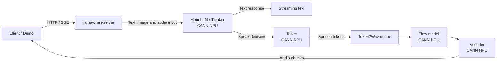

# MiniCPM-o 4.5 on Ascend 910C

> 基于 `llama.cpp-omni` 的全模态模型部署与推理优化项目，面向单卡 Ascend 910C 环境，
> 重点优化 SPEAK 生成阶段的 SPEAK→WAV 完整链路。

## 官方评测目标

本仓库对应 **llama.cpp-omni 子赛道**（赛道一，子赛道 A）。正式评测在以下统一环境中执行：

| 参数 | 值 |
|------|-----|
| 硬件 | Ascend 910C 单卡 |
| 运行环境 | CANN 9.1.0-beta1 |
| 权重精度 | F16 |
| 并发 | 1 |

在通过精度和 Demo 准入后，**主要排名指标为 SPEAK 生成阶段的 SPEAK→WAV 完整链路 RTF**。

全双工推理分三种状态，只有 SPEAK 生成阶段计入排名：

| 阶段 | 运行模块 | 计入排名 |
|------|---------|---------|
| LISTEN | VPM + APM + LLM | ❌ |
| **SPEAK 生成** | VPM + APM + LLM + TTS + T2W | ✅ **排名依据** |
| SPEAK 尾部 | 仅 TTS + T2W (LLM 已结束) | ❌ |

官方 F16 性能基线：

| 指标 | 基线值 | 用途 |
|------|--------|------|
| 全部 chunk 平均 RTF | 0.618 | 仅供参考 |
| **SPEAK→WAV 完整链路 RTF** | **1.087** | **排名依据** |

官方精度准入阈值（四项必须全部满足）：

| Benchmark | 基线 | 准入阈值 | 规则 |
|-----------|------|---------|------|
| VideoMME | 69.0 | ≥ 67.0 | 绝对下降 ≤ 2pp |
| Daily-Omni | 79.5 | ≥ 77.5 | 绝对下降 ≤ 2pp |
| TTS-Seed ASV | 0.709 | ≥ 0.689 | 绝对下降 ≤ 0.02 |
| TTS-Seed WER | 1.414 | ≤ 1.56 | 相对增幅 ≤ 10% |

完整官方规范: [`docs/competition-submission/OFFICIAL_EVALUATION_SPEC.md`](docs/competition-submission/OFFICIAL_EVALUATION_SPEC.md)

## 项目背景

比赛评测流程：

```text
框架与环境可运行
        ↓
三项 Benchmark 精度准入（四项阈值，缺一不可）
        ↓
官方 Demo 端到端稳定可用（准入条件）
        ↓
SPEAK→WAV 完整链路 RTF（排名依据）
        ↓
主办方在官方环境中重新复现
```

**精度和 Demo 可用性属于准入条件。只有通过这两项检查后，优化版本才会进入性能排名。**
仅能运行 Benchmark、但无法正常接入官方 Demo 的方案，不满足本赛道的准入要求。

目前仓库已完成内部冻结候选、二进制复现、稳定性回归和比赛工具链准备工作。
官方 Starter Kit、Benchmark Harness 尚未到位。官方评测规范已于 2026-08-05 发布——
精度阈值、性能基线、SPEAK 阶段定义和 Demo 准入要求已正式明确。

## 为什么 MiniCPM-o 4.5 的部署更复杂

普通文本模型的主要推理链路通常可以概括为：

> Prompt → Prefill → Decode → Text

MiniCPM-o 4.5 的服务链路则长得多：

> Multimodal Input → Main LLM → Talker → Flow → Vocoder → Streaming Audio

一次完整交互会经过主语言模型的文本推理、Talker 的语音 token 生成、Flow 的条件 mel 转换
和 Vocoder 的波形合成。不同模块可能使用不同的运行时、缓存和设备后端。一处模块仍在 CPU，
或者一次 Host/NPU 同步位于关键路径，都可能直接拉长首音时间。

因此本项目采用的核心方法不是单纯观察 NPU 利用率，而是：

1. 拆分请求阶段，对每个阶段建立时间预算；
2. 检查模块和 Tensor 的真实设备放置；
3. 通过单因素 A/B 验证每一项改动的收益；
4. 使用连续请求和故障注入验证服务生命周期；
5. 冻结源码和二进制后重新回归全部 Gate。

## 我们做了什么

项目最初版本虽然能够完成推理，但语音生成链路中的部分计算仍运行在 CPU，服务器生命周期、
TTS KV Cache 和流式接口也存在稳定性问题。

围绕 Decode-to-Speak 关键路径，完成了以下工作：

- 通过 profiling 确认 T2W（Flow + Vocoder）在 CPU 上运行，占首音延迟的 93%，是 Amdahl 第一瓶颈；
- 将 Flow 和 Vocoder 从 CPU 路径迁移到 CANN NPU，保持零源码修改，仅通过环境变量切换后端；
- 引入 Static Prefix KV Cache，将重复的系统前缀 prefill 从每次 206ms 降至首次保存、后续 85ms；
- 将一次性运行方式改造成可持续处理多轮请求的 Persistent Server，修复 drain timeout 导致的
  context 失效问题；
- 修正 Token2Wav generation 的 active accounting 和 drain 判定条件，消除跨请求 polling 竞争；
- 为 TTS KV Cache 增加边界保护，单请求内 cap prefill 上限，避免长请求导致上下文越界；
- 补齐非流式文本输出字段、SSE crash 修复和多模态 prefill 协议修正 —— 这些不是简单的接口修补，
  而是在为官方 Demo Gate 准备稳定的端到端链路；
- 通过连续请求、断连恢复、故障注入和冻结二进制回归（T6, 11/11 PASS）验证稳定性；
- 建立从源码、二进制、配置到实验结果的完整证据索引。

我们还做了一项负实验（B6b：调低 TTS chunk 阈值试图更早触发 TTS），CI 跨 0，被明确 **REJECT**。

## 内部结果

> 以下数字全部来自内部 A/B 实验。**它们不是官方 SPEAK→WAV RTF**，不是完整请求 E2E 指标，
> 不能与官方 baseline 1.087 直接比较。
>
> - 内部 "Request-to-first-WAV" = HTTP 请求到首个 WAV 文件 mtime，单位为 ms，关注首音延迟
> - 官方的 1.087 = SPEAK 生成阶段内完整链路耗时 ÷ chunk 时长，为无量纲 RTF 比值
> - 内部 T2W 线程 RTF (~0.23-0.28) 仅覆盖 Flow+Vocoder，不包含 Main LLM/Talker/TTS
>
> 两者单位和计时边界都不同。当前正确描述为：
> **已通过内部实验确认设备迁移具有显著收益；下一步需按官方 SPEAK→WAV 完整链路口径重新测量正式 RTF。**
>
> 详见 [`docs/competition-submission/OFFICIAL_EVALUATION_SPEC.md`](docs/competition-submission/OFFICIAL_EVALUATION_SPEC.md)
> 和 [`docs/competition-submission/RTF_PARSER_AUDIT.md`](docs/competition-submission/RTF_PARSER_AUDIT.md)。

### 首段语音延迟（Request-to-first-WAV）

最初，即使主语言模型已经卸载到 NPU，Flow 和 Vocoder 仍主要位于 CPU 路径。
从 HTTP 请求进入服务到第一段音频产生，p50 大约需要 **4.8 秒**。

通过将 T2W 中的 Flow 和 Vocoder 迁移到 CANN NPU（env-only 配置，零源码修改），
这一延迟降至 **约 0.9 秒**。

| 指标 | CPU T2W Baseline | CANN T2W Candidate | 变化 |
|---|---:|---:|---:|
| Request-to-first-WAV p50 | 4,798 ms | 894 ms | **−3,904 ms (−81.4%)** |
| CI95 (bootstrap, 10k resamples) | — | [−4,220, −3,732] ms | 不含 0 |
| 样本 | 32 strict matched pairs | 32 strict matched pairs | 同 binary / 硬件 / 模型 / prompt |

32 对实验覆盖了短文本、长文本、带图片、带音频四种典型场景，降幅均在 −79% 到 −83% 之间，
没有 CPU fallback，WAV 输出（16-bit PCM @24kHz）逐 bit 校验无损。

"Request-to-first-WAV" 指 HTTP 请求到首个 WAV 文件 mtime 的 wall-clock 时间。
标签：`HISTORICAL_INTERNAL_RESULT`。

证据: [`docs/F6_PHASE2_STEP6_CANN_T2W_AB.md`](docs/F6_PHASE2_STEP6_CANN_T2W_AB.md) +
[`docs/f6-s13-closure/phase2/step6_cann_t2w_ab.json`](docs/f6-s13-closure/phase2/step6_cann_t2w_ab.json)

### Static Prefix KV Cache

每次请求开头都有一段固定的 system prompt 和 reference audio embedding，即使内容不变，
prefill 阶段也要重新计算一遍，p50 耗时约 206ms。

我们实现了 prefix KV cache 复用：首次请求把 prefill 结果保存到 CANN buffer，后续请求
直接从 cache 加载，跳过 prefill 阶段。

| 模式 | Prefill p50 |
|---|---:|
| Prefix Cache MISS | 206 ms |
| Prefix Cache HIT | 85 ms |
| 降低 | 121 ms / 58.7% |
| 加速比 | 2.4× |

30 组 strict matched pairs 全部通过 KV 完整性校验。该功能通过 `OMNI_KV_CACHE_REUSE=1`
按需开启（默认关闭）。标签：`INTERNAL_PREFILL_STAGE_RESULT`。

证据: [`docs/tracking/f6_lifecycle/R13_CANONICAL_STATIC_PREFIX_AB_FINAL.md`](docs/tracking/f6_lifecycle/R13_CANONICAL_STATIC_PREFIX_AB_FINAL.md)

## 系统链路

MiniCPM-o 4.5 的语音输出并不是主语言模型直接生成波形。主模型首先完成多模态理解和文本推理，
当模型决定进入语音生成后，Talker 继续生成语音 token，再由 Token2Wav、Flow 和 Vocoder
转换成可以播放的音频块。



当前冻结候选中，主模型权重、Flow 和 Vocoder 位于 CANN NPU；请求控制、部分元数据、采样和
最终输出处理仍由 Host CPU 完成。因此 `-ngl 999` 不应被理解为整个服务完全没有 CPU 参与。
CANN 设备放置的源码级审计见 [`docs/audit/CANN_CPU_NPU_PLACEMENT_AUDIT.md`](docs/audit/CANN_CPU_NPU_PLACEMENT_AUDIT.md)。

## Demo 准入要求

`llama.cpp-omni` 优化版本必须能够接入官方 [MiniCPM-o-Demo](https://github.com/OpenBMB/MiniCPM-o-Demo)，
完成稳定的端到端运行。主办方将检查：

- 模型服务能否正常启动
- Demo 能否连接推理服务
- 文本、音频和视频输入能否正常处理
- 模型输出是否完整
- 流式语音输出是否连续
- 是否存在明显卡顿、中断或异常退出
- 是否能够完成官方指定的完整交互流程
- 连续运行过程中是否保持稳定

**仅能运行 Benchmark、但无法正常接入官方 Demo 的方案，不满足准入条件。**

我们已经在代码层面为 Demo Gate 做了准备——非流式文本输出、SSE 稳定性、多模态 prefill 协议修正、
Persistent Server 生命周期、连续请求和断连恢复——这些都是 Demo 端到端可用的前置条件。

官方 Demo 前端已 clone 并 pin 在 [`ba7fa9c`](https://github.com/OpenBMB/MiniCPM-o-Demo/commit/ba7fa9cc6ad63c894f1bd5e5afac28466953519d)（`submission/scripts/fetch_demo.sh`）。
Demo Gate 检查表（D1–D12）见 [`submission/demo/DEMO_GATE_CHECKLIST.md`](submission/demo/DEMO_GATE_CHECKLIST.md)。
当前推理环境和模型权重不在本机，全部 D1–D12 标记 `NOT_RUN`。

## 官方 Gate 状态

按正式测评流程排列：

| Gate | 赛事要求 | 当前状态 |
|------|---------|---------|
| G1 Framework & Environment | 在官方昇腾环境部署 llama.cpp-omni | `INTERNAL_PASS`（内部环境通过，官方环境待验证） |
| G2 Daily-Omni Accuracy | 精度降幅 ≤ 2pp vs 官方 baseline | `NOT_RUN` |
| G3 TTS-Seed Accuracy | 精度降幅 ≤ 2pp vs 官方 baseline | `NOT_RUN` |
| G4 Video-MME Accuracy | 精度降幅 ≤ 2pp vs 官方 baseline | `NOT_RUN` |
| G5 Official Demo | 接入 MiniCPM-o-Demo，端到端稳定交互 | `NOT_RUN` |
| G6 Per-chunk RTF | 每 audio chunk RTF（统一硬件/环境/模型/数据/脚本） | `NOT_RUN` |
| G7 Engineering Reproduction | 主办方在官方环境重新部署并复现 | `PARTIAL_READY`（工具链已备，G2-G6 需先通过） |
| G8 Final Package Review | 按要求提交全部材料 | `NOT_READY` |

完整 Gate 矩阵: [`docs/competition-submission/OFFICIAL_GATE_MATRIX.md`](docs/competition-submission/OFFICIAL_GATE_MATRIX.md)

```
CANDIDATE_SOURCE_COMMIT                  = bdd4550
FINAL_INTERNAL                           = PASS
REPRODUCIBLE_BINARY                       = PASS
T6_FROZEN_BINARY_REGRESSION              = PASS (11/11)
DEMO_ASSETS_CLONED                        = YES (ba7fa9c)

OFFICIAL_EVALUATION_SPEC                  = AVAILABLE
OFFICIAL_FULL_DATASET_BASELINE            = AVAILABLE
OFFICIAL_ACCURACY_THRESHOLDS              = AVAILABLE
OFFICIAL_BENCHMARK_ASSETS                 = AVAILABLE
OFFICIAL_RTF_HARNESS                      = AVAILABLE
OFFICIAL_DEMO_REPOSITORY                  = AVAILABLE
OFFICIAL_GATE_EXECUTION                   = READY

OFFICIAL_LLAMA_SPEAK_TO_WAV_RTF_BASELINE  = 1.087
OFFICIAL_LLAMA_ALL_CHUNK_RTF_REF          = 0.618
OFFICIAL_METRIC_SCOPE                     = SPEAK_GENERATION
OFFICIAL_METRIC_CHAIN                     = SPEAK_TO_WAV_FULL_CHAIN
OFFICIAL_TEST_CONCURRENCY                 = 1
OFFICIAL_WEIGHT_PRECISION                 = F16

OFFICIAL_VIDEO_MME                        = NOT_RUN
OFFICIAL_DAILY_OMNI                       = NOT_RUN
OFFICIAL_TTS_SEED_ASV                     = NOT_RUN
OFFICIAL_TTS_SEED_WER                     = NOT_RUN
OFFICIAL_DEMO_GATE                        = NOT_RUN
OFFICIAL_SPEAK_TO_WAV_RTF                 = NOT_RUN
OFFICIAL_REPRODUCTION                     = NOT_RUN

OFFICIAL_SUBMISSION_PACKAGE               = NOT_READY
COMPETITION_COMPLETE                      = NOT_CLAIMED
```

**最终比赛成绩以主办方在官方硬件、镜像、Starter Kit 和测试脚本中重新部署并复现得到的结果为准。**

## 完成的优化

| 优化项 | 解决的问题 | 方案 | 文档 |
|--------|-----------|------|------|
| CANN T2W 迁移 | Flow+Vocoder 在 CPU，占首音延迟 93% | env-only 设备切换，零代码修改 | [link](docs/F6_PHASE2_STEP6_CANN_T2W_AB.md) |
| Static Prefix KV Cache | 每次请求重复 prefill 固定前缀（206ms） | 首次 save → 后续 load | [link](docs/tracking/f6_lifecycle/R13_CANONICAL_STATIC_PREFIX_AB_FINAL.md) |
| 持久服务生命周期 | drain timeout 导致 context 失效 | 修复 drain / timeout / ctx validity | [link](docs/tracking/F6_C6_PROFILE_LIFECYCLE_STATE_MACHINE.md) |
| Per-generation active 计数 | 跨请求 polling 竞争 | per-generation 粒度 active 标记 | [link](docs/tracking/) |
| TTS KV bounds guard | n_past 触及 n_ctx 上限 | prefill 阶段 cap at 256 | [link](docs/tracking/) |
| 非流式 text 输出 | 非流式响应缺 text 字段 | 补齐 text 字段 | [link](docs/tracking/) |
| SSE crash 修复 | worker 退出后 bad_alloc | worker-once + sink.done guard | [link](docs/tracking/) |
| 多模态 prefill 协议 | media_type=2 user_text / think-loop 格式 | 修正 prompt 身份与格式 | [link](docs/f6-s13-closure/) |
| T6 集成回归 | 确认冻结 binary 下所有 Gate | 11/11 PASS, 0 cpu_fallback, 0 cann_error | [link](docs/f6-s13-closure/phase2/T6_INTEGRATED_REGRESSION_REPORT.md) |

## 快速开始

```bash
# 环境变量
export OMNI_T2W_DEVICE=cann-flow-only
export OMNI_VOC_DEVICE=gpu
export OMNI_KV_CACHE_REUSE=1
export ASCEND_RT_VISIBLE_DEVICES=0

# 启动 server
./build/bin/llama-omni-server \
  -m "${MODEL_PATH}/MiniCPM-o-4_5-F16.gguf" \
  -ngl 999 -fa off -c 4096 -b 512 -ub 512 \
  --split-mode layer --device CANN0 \
  --no-mmap --mlock \
  --port 18093

# 健康检查
curl -s "http://127.0.0.1:18093/health"
```

详细步骤见 [`docs/F6_QUICKSTART.md`](docs/F6_QUICKSTART.md)，完整复现流程见
[`docs/F6_REPRODUCTION_GUIDE.md`](docs/F6_REPRODUCTION_GUIDE.md)。

Demo 前端获取（已 pin commit ba7fa9c）:
```bash
bash submission/scripts/fetch_demo.sh
```

## 文档导航

| 你想做什么 | 推荐文档 |
|-----------|---------|
| 快速跑起来 | [`docs/F6_QUICKSTART.md`](docs/F6_QUICKSTART.md) |
| 看完整性能数据和实验口径 | [`docs/F6_OPTIMIZATION_AND_RESULTS.md`](docs/F6_OPTIMIZATION_AND_RESULTS.md) |
| 理解架构和组件关系 | [`docs/F6_ARCHITECTURE.md`](docs/F6_ARCHITECTURE.md) |
| 了解实验方法论和工程原则 | [`docs/F6_METHODOLOGY.md`](docs/F6_METHODOLOGY.md) |
| 从头复现所有实验 | [`docs/F6_REPRODUCTION_GUIDE.md`](docs/F6_REPRODUCTION_GUIDE.md) |
| 核对每一项结论的证据 | [`docs/F6_EVIDENCE_INDEX.md`](docs/F6_EVIDENCE_INDEX.md) |
| 查阅官方评测规范（精度/基线/SPEAK定义） | [`docs/competition-submission/OFFICIAL_EVALUATION_SPEC.md`](docs/competition-submission/OFFICIAL_EVALUATION_SPEC.md) |
| 查看比赛 Gate 和准入条件 | [`docs/competition-submission/OFFICIAL_GATE_MATRIX.md`](docs/competition-submission/OFFICIAL_GATE_MATRIX.md) |
| 了解 RTF parser 与官方口径差异 | [`docs/competition-submission/RTF_PARSER_AUDIT.md`](docs/competition-submission/RTF_PARSER_AUDIT.md) |
| 审查 Demo Gate 检查表 | [`submission/demo/DEMO_GATE_CHECKLIST.md`](submission/demo/DEMO_GATE_CHECKLIST.md) |
| 盘点官方执行资产获取状态 | [`docs/competition-submission/OFFICIAL_ASSET_INVENTORY.md`](docs/competition-submission/OFFICIAL_ASSET_INVENTORY.md) |
| 核对提交材料覆盖度 | [`docs/competition-submission/SUBMISSION_CHECKLIST.md`](docs/competition-submission/SUBMISSION_CHECKLIST.md) |
| 查看比赛状态和已知限制 | [`docs/F6_LIMITATIONS_AND_OFFICIAL_GATES.md`](docs/F6_LIMITATIONS_AND_OFFICIAL_GATES.md) |
| 审查 CANN 设备放置源码 | [`docs/audit/CANN_CPU_NPU_PLACEMENT_AUDIT.md`](docs/audit/CANN_CPU_NPU_PLACEMENT_AUDIT.md) |
| 查阅 vLLM-Omni 迁移方案 | [`docs/vllm-migration/`](docs/vllm-migration/) |

## 版本与 Tag

| Tag | 说明 |
|-----|------|
| `f6-candidate-source-bdd4550`（→ `80c30cd`） | 冻结候选源码。与原始 `bdd4550` 源码完全一致，仅移除了 git history 中误提交的 msprof 大文件（>100MB，超出 GitHub 限制）。 |
完整 Tag 历史见 [`docs/tracking/TAGS.md`](docs/tracking/TAGS.md)。

## 已知限制

### 官方评测 —— 全部待运行

G2–G6 五项官方评测目前都未运行，原因是比赛官方 Starter Kit 尚未到达。

### CANN 设备放置 —— 静态已确认，运行时待测

源码层面已完成 CANN backend 设备放置的完整审计，静态分析全部 **PASS**。
但 CANN profiler timeline、backend 分配日志和逐 chunk CPU/NPU 耗时分解尚未测量。
`MAIN_LLM_RUNTIME_PLACEMENT = PARTIAL`，`CPU_PER_CHUNK_CRITICAL_PATH` 等四项
标记为 `NOT_MEASURED` 或 `TO_MEASURED`。

完整分析见 [`docs/F6_LIMITATIONS_AND_OFFICIAL_GATES.md`](docs/F6_LIMITATIONS_AND_OFFICIAL_GATES.md)。

## 不包含的内容

模型权重（MiniCPM-o-4_5-F16.gguf, ~16 GB）、编译产物、音频 profiling 数据、
Demo 视频和官方 Benchmark 结果均不在本仓库中。

## 上游与许可证

本项目基于 [llama.cpp](https://github.com/ggml-org/llama.cpp) 和
[llama.cpp-omni](https://github.com/ggml-org/llama.cpp-omni)，保留上游 MIT License
（[`LICENSE`](LICENSE)）。

上游原始 README 保存在 [`docs/upstream/LLAMA_CPP_OMNI_README.md`](docs/upstream/LLAMA_CPP_OMNI_README.md)。
模型：[MiniCPM-o 4.5](https://github.com/OpenBMB/MiniCPM-o) by ModelBest & Tsinghua University。

---

> **INTERNAL_COMPETITION_HANDOFF** — 本仓库为内部比赛交接状态，不代表官方最终提交。
> `COMPETITION_COMPLETE = NOT_CLAIMED`。
