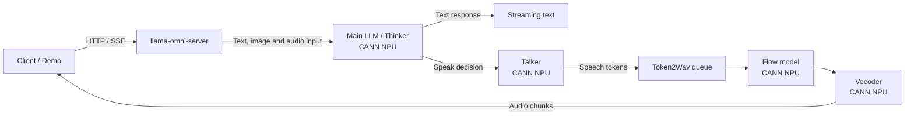

# MiniCPM-o 4.5 on Ascend 910C

> 基于 `llama.cpp-omni` 的全模态模型部署与推理优化项目，面向单卡 Ascend 910C 环境，
> 重点优化从模型完成文本推理到生成首段语音的 Decode-to-Speak 链路。

## 项目背景

本项目来自全模态大模型在昇腾算力平台上的部署优化比赛。

与只生成文本的语言模型不同，MiniCPM-o 4.5 不仅需要理解文本，还要处理图像、音频等多模态输入，
并在同一条请求链路中继续完成语音生成。一次完整交互会经过主语言模型、Talker、Token2Wav、Flow
和 Vocoder 等多个阶段。

这意味着，模型能够在 NPU 上成功加载，只是部署工作的第一步。真正影响用户体验的，是以下问题：

- 从用户请求到第一段语音需要等待多久；
- Flow 和 Vocoder 是否真正运行在 CANN NPU 上；
- 多轮请求后模型状态和 KV Cache 是否能够正确释放；
- 文本、语音和流式输出能否在同一个服务中稳定工作；
- 性能优化是否能够在不破坏精度和 Demo 可用性的前提下复现。

项目最初版本虽然能够完成推理，但语音生成链路中的部分计算仍运行在 CPU，服务器生命周期、
TTS KV Cache 和流式接口也存在稳定性问题。我们的工作并不是单独优化某一个算子，而是从完整
请求链路出发，对设备放置、缓存复用、线程生命周期、流式输出和异常恢复进行系统性分析和修正。

## 为什么 MiniCPM-o 4.5 的部署更复杂

普通文本模型的主要推理链路通常可以概括为：

> Prompt → Prefill → Decode → Text

MiniCPM-o 4.5 的服务链路则长得多：

> Multimodal Input → Main LLM → Talker → Flow → Vocoder → Streaming Audio

其中既包含 Transformer Decode，也包含语音 Token 生成、条件 Flow 和 Vocoder。
不同模块可能使用不同的运行时、缓存和设备后端。一处模块仍在 CPU，或者一次 Host/NPU 同步
位于关键路径，都可能直接拉长首音时间。

因此本项目采用的核心方法不是单纯观察 NPU 利用率，而是：

1. 拆分请求阶段，对每个阶段建立时间预算；
2. 检查模块和 Tensor 的真实设备放置；
3. 通过单因素 A/B 验证每一项改动的收益；
4. 使用连续请求和故障注入验证服务生命周期；
5. 冻结源码和二进制后重新回归全部 Gate。

## 比赛目标

本仓库对应比赛中的 `llama.cpp-omni` 优化方向，目标是在单卡 Ascend 910C 上完成
MiniCPM-o 4.5 的稳定部署，并围绕流式语音链路降低逐音频块处理时间。

正式比赛验收还包括 Daily-Omni 准确率、TTS-Seed 指标、Video-MME 指标、官方 Demo 可用性、
官方 per-audio-chunk RTF，以及相对框架官方 Baseline 的精度变化。

当前仓库已经完成内部冻结候选、二进制复现、稳定性回归和比赛工具链准备。官方 Starter Kit、
Benchmark Harness 和 Demo 资产尚未到位，因此：

- `FINAL_INTERNAL = PASS`
- `OFFICIAL_GATES = BLOCKED_BY_OFFICIAL_STARTER_KIT`
- `COMPETITION_COMPLETE = NOT_CLAIMED`

## 我们做了什么

围绕 Decode-to-Speak 关键路径，项目主要完成了以下工作：

- 通过 profiling 确认 T2W（Flow + Vocoder）在 CPU 上运行，占首音延迟的 93%，是 Amdahl 第一瓶颈；
- 将 Flow 和 Vocoder 从 CPU 路径迁移到 CANN NPU，保持零源码修改，仅通过环境变量切换后端；
- 引入 Static Prefix KV Cache，将重复的系统前缀 prefill 从每次 206ms 降至首次保存、后续 85ms；
- 将一次性运行方式改造成可持续处理多轮请求的 Persistent Server，修复 drain timeout 导致的
  context 失效问题；
- 修正 Token2Wav generation 的 active accounting 和 drain 判定条件，消除跨请求 polling 竞争；
- 为 TTS KV Cache 增加边界保护，单请求内 cap prefill 上限，避免长请求导致上下文越界；
- 补齐非流式文本输出字段、SSE crash 修复（worker-once + sink.done guard）和多模态 prefill
  协议修正（media_type=2 场景下的 user_text 和 think-loop 格式）；
- 通过连续请求、断连恢复、故障注入和冻结二进制回归（T6, 11/11 PASS）验证稳定性；
- 建立从源码、二进制、配置到实验结果的完整证据索引（16 项，含 RAW_PERSISTED 和 REPORT_ONLY）。

我们还做了一项负实验（B6b：调低 TTS chunk 阈值试图更早触发 TTS），CI 跨 0，被明确 **REJECT**。

## 核心内部结果

> 以下数字全部来自内部 A/B 实验，不等同于官方 per-chunk RTF 或完整端到端指标。
> 完整实验口径和原始数据见 [`docs/F6_OPTIMIZATION_AND_RESULTS.md`](docs/F6_OPTIMIZATION_AND_RESULTS.md)。

### 首段语音延迟（Request-to-first-WAV）

最初，即使主语言模型已经卸载到 NPU，Flow 和 Vocoder 仍主要位于 CPU 路径。
从 HTTP 请求进入服务到第一段音频产生，p50 大约需要 **4.8 秒**。

通过将 T2W 中的 Flow 和 Vocoder 迁移到 CANN NPU（env-only 配置，零源码修改），
这一延迟降至 **约 0.9 秒**。

| 指标 | CPU T2W Baseline | CANN T2W Candidate | 变化 |
|---|---:|---:|---:|
| Request-to-first-WAV p50 | 4,798 ms | 894 ms | **−3,904 ms (−81.4%)** |
| CI95 (bootstrap, 10k resamples) | — | [−4,220, −3,732] ms | 不含 0 |
| 样本 | 32 strict matched pairs | 32 strict matched pairs | 同 binary / 硬件 / 模型 / prompt |

32 对实验覆盖了短文本、长文本、带图片、带音频四种典型场景，每种场景的降幅均在 −79% 到
−83% 之间，没有出现 CPU fallback，WAV 输出（16-bit PCM @24kHz）逐 bit 校验无损。

这里的 "Request-to-first-WAV" 指 HTTP 请求到首个 WAV 文件 mtime 的 wall-clock 时间。
它是项目内部的首音指标——不是官方 per-chunk RTF，不是完整请求 E2E 指标，不是 vLLM-Omni 的实验结果。
标签：`HISTORICAL_INTERNAL_RESULT`。

证据: [`docs/F6_PHASE2_STEP6_CANN_T2W_AB.md`](docs/F6_PHASE2_STEP6_CANN_T2W_AB.md) +
[`docs/f6-s13-closure/phase2/step6_cann_t2w_ab.json`](docs/f6-s13-closure/phase2/step6_cann_t2w_ab.json)

### Static Prefix KV Cache

每次请求开头都有一段固定的 system prompt 和 reference audio embedding，即使内容不变，
prefill 阶段也要重新计算一遍，p50 耗时约 206ms。

我们实现了 prefix KV cache 复用：首次请求把 prefill 结果保存到 CANN buffer，后续请求
直接从 cache 加载，跳过 prefill 阶段。

| 模式 | Prefill p50 |
|---|---:|
| Prefix Cache MISS | 206 ms |
| Prefix Cache HIT | 85 ms |
| 降低 | 121 ms / 58.7% |
| 加速比 | 2.4× |

30 组 strict matched pairs 全部通过 KV 完整性校验（0 次 NOT_REUSABLE）。在冻结 binary 的
T6 回归中进一步确认了 28/30 有效（2 对被 A_ERR 排除，文档已记录）。该功能通过
`OMNI_KV_CACHE_REUSE=1` 按需开启（默认关闭）。

这是内部 Prefill 阶段结果，不等同于官方音频 chunk RTF。标签：`INTERNAL_PREFILL_STAGE_RESULT`。

证据: [`docs/tracking/f6_lifecycle/R13_CANONICAL_STATIC_PREFIX_AB_FINAL.md`](docs/tracking/f6_lifecycle/R13_CANONICAL_STATIC_PREFIX_AB_FINAL.md)

## 系统链路

MiniCPM-o 4.5 的语音输出并不是主语言模型直接生成波形。主模型首先完成多模态理解和文本推理，
当模型决定进入语音生成后，Talker 继续生成语音 token，再由 Token2Wav、Flow 和 Vocoder
转换成可以播放的音频块。



当前冻结候选中，主模型权重、Flow 和 Vocoder 位于 CANN NPU；请求控制、部分元数据、采样和
最终输出处理仍由 Host CPU 完成。因此 `-ngl 999` 不应被理解为整个服务完全没有 CPU 参与。
CANN 设备放置的源码级审计见 [`docs/audit/CANN_CPU_NPU_PLACEMENT_AUDIT.md`](docs/audit/CANN_CPU_NPU_PLACEMENT_AUDIT.md)。

## 完成的优化

| 优化项 | 解决的问题 | 方案 | 文档 |
|--------|-----------|------|------|
| CANN T2W 迁移 | Flow+Vocoder 在 CPU，占首音延迟 93% | env-only 设备切换，零代码修改 | [link](docs/F6_PHASE2_STEP6_CANN_T2W_AB.md) |
| Static Prefix KV Cache | 每次请求重复 prefill 固定前缀（206ms） | 首次 save → 后续 load，跳过 prefill | [link](docs/tracking/f6_lifecycle/R13_CANONICAL_STATIC_PREFIX_AB_FINAL.md) |
| 持久服务生命周期 | drain timeout 导致 context 失效，多轮请求不可用 | 修复 drain / timeout / ctx validity | [link](docs/tracking/F6_C6_PROFILE_LIFECYCLE_STATE_MACHINE.md) |
| Per-generation active 计数 | 跨请求 polling 竞争导致 drain 误判 | 改为 per-generation 粒度的 active 标记 | [link](docs/tracking/) |
| TTS KV bounds guard | 单请求内 n_past 可能触及 n_ctx 上限 | prefill 阶段 cap at 256 | [link](docs/tracking/) |
| 非流式 text 输出 | 非流式响应缺少 text 字段 | 补齐 text 到非流式响应 | [link](docs/tracking/) |
| SSE crash 修复 | worker 退出后 sink.done → bad_alloc | worker-once + sink.done guard | [link](docs/tracking/) |
| 多模态 prefill 协议 | media_type=2 场景 user_text 丢失、think-loop 格式错误 | 修正 prompt 身份与格式 | [link](docs/f6-s13-closure/) |
| T6 集成回归 | 需确认冻结 binary 下所有 Gate | 11/11 PASS, 0 cpu_fallback, 0 cann_error | [link](docs/f6-s13-closure/phase2/T6_INTEGRATED_REGRESSION_REPORT.md) |

## 快速开始

```bash
# 环境变量
export OMNI_T2W_DEVICE=cann-flow-only
export OMNI_VOC_DEVICE=gpu
export OMNI_KV_CACHE_REUSE=1
export ASCEND_RT_VISIBLE_DEVICES=0

# 启动 server
./build/bin/llama-omni-server \
  -m "${MODEL_PATH}/MiniCPM-o-4_5-F16.gguf" \
  -ngl 999 -fa off -c 4096 -b 512 -ub 512 \
  --split-mode layer --device CANN0 \
  --no-mmap --mlock \
  --port 18093

# 健康检查
curl -s "http://127.0.0.1:18093/health"
```

详细步骤见 [`docs/F6_QUICKSTART.md`](docs/F6_QUICKSTART.md)，完整复现流程见
[`docs/F6_REPRODUCTION_GUIDE.md`](docs/F6_REPRODUCTION_GUIDE.md)。

## 文档导航

按阅读需求组织：

| 你想做什么 | 推荐文档 |
|-----------|---------|
| 快速跑起来 | [`docs/F6_QUICKSTART.md`](docs/F6_QUICKSTART.md) |
| 看完整性能数据和实验口径 | [`docs/F6_OPTIMIZATION_AND_RESULTS.md`](docs/F6_OPTIMIZATION_AND_RESULTS.md) |
| 理解架构和组件关系 | [`docs/F6_ARCHITECTURE.md`](docs/F6_ARCHITECTURE.md) |
| 了解实验方法论和工程原则 | [`docs/F6_METHODOLOGY.md`](docs/F6_METHODOLOGY.md) |
| 从头复现所有实验 | [`docs/F6_REPRODUCTION_GUIDE.md`](docs/F6_REPRODUCTION_GUIDE.md) |
| 核对每一项结论的证据 | [`docs/F6_EVIDENCE_INDEX.md`](docs/F6_EVIDENCE_INDEX.md) |
| 查看比赛状态和已知限制 | [`docs/F6_LIMITATIONS_AND_OFFICIAL_GATES.md`](docs/F6_LIMITATIONS_AND_OFFICIAL_GATES.md) |
| 审查 CANN 设备放置源码 | [`docs/audit/CANN_CPU_NPU_PLACEMENT_AUDIT.md`](docs/audit/CANN_CPU_NPU_PLACEMENT_AUDIT.md) |
| 了解提交工具链 | [`docs/competition-submission/`](docs/competition-submission/) |
| 查阅 vLLM-Omni 迁移方案 | [`docs/vllm-migration/`](docs/vllm-migration/) |

## 版本与 Tag

| Tag | 说明 |
|-----|------|
| `f6-candidate-source-bdd4550`（→ `80c30cd`） | 冻结候选源码。与原始 `bdd4550` 源码完全一致，仅移除了 git history 中误提交的 msprof 大文件（>100MB，超出 GitHub 限制）。 |
| `f6-handoff-ba958a2`（→ `ba958a2`） | 当前交接 HEAD，含完整文档、审计、提交工具链和本 README。 |
| `f6-handoff-5df2add`（→ `5df2add`） | 前一版交接 tag（README 重写前）。 |

`main` 分支指向 `ba958a2`（最新交接 HEAD），`perf/f6-decode-to-speak` 指向 `5df2add`（文档版 HEAD）。

## 已知限制

### 官方评测 —— 全部待运行

Daily-Omni 准确率、TTS-Seed 指标、Video-MME 指标、Demo 验收和 per-chunk RTF 这五项
官方评测目前都未运行，原因是比赛官方 Starter Kit 尚未到达。我们内部的 Daily-Omni pilot
只跑了 6/6 server 端 gates（功能连通性），不是全量准确率评测。

### CANN 设备放置 —— 静态已确认，运行时待测

源码层面已完成 CANN backend 设备放置的完整审计：哪些 op 支持 CANN、offload 触发条件
（`ne[1] >= 32`）、scheduler 如何分配 weight tensor、sync/copy 调用点。这些静态分析
全部 **PASS**。

但 CANN profiler timeline、backend 分配日志和 per-chunk 的 CPU/NPU 逐段耗时分解尚未测量。
因此 `MAIN_LLM_RUNTIME_PLACEMENT = PARTIAL`，`CPU_PER_CHUNK_CRITICAL_PATH`、
`GRAPH_SPLIT_RUNTIME_COUNT`、`STREAM_SYNC_RUNTIME_COST` 和 `D2H_COST` 四项标记为
`NOT_MEASURED` 或 `TO_MEASURED`。

另外 Ascend 910C 上 `caps.async = false`（CANN backend 不支持通用异步计算流水线），
Flash Attention 扩展实现仅覆盖 F16 dtype。

完整分析见 [`docs/F6_LIMITATIONS_AND_OFFICIAL_GATES.md`](docs/F6_LIMITATIONS_AND_OFFICIAL_GATES.md)。

## 不包含的内容

模型权重（MiniCPM-o-4_5-F16.gguf, ~16 GB）、编译产物（build/）、音频 profiling 数据、
Demo 视频和官方 Benchmark 结果均不在本仓库中。模型 SHA256 验证方式见
[`docs/F6_QUICKSTART.md`](docs/F6_QUICKSTART.md)。

## 上游与许可证

本项目基于 [llama.cpp](https://github.com/ggml-org/llama.cpp) 和
[llama.cpp-omni](https://github.com/ggml-org/llama.cpp-omni)，保留上游 MIT License
（[`LICENSE`](LICENSE)）。

上游原始 README 保存在 [`docs/upstream/LLAMA_CPP_OMNI_README.md`](docs/upstream/LLAMA_CPP_OMNI_README.md)。
模型：[MiniCPM-o 4.5](https://github.com/OpenBMB/MiniCPM-o) by ModelBest & Tsinghua University。

---

> **INTERNAL_COMPETITION_HANDOFF** — 本仓库为内部比赛交接状态，不代表官方最终提交。
> `COMPETITION_COMPLETE = NOT_CLAIMED`。
