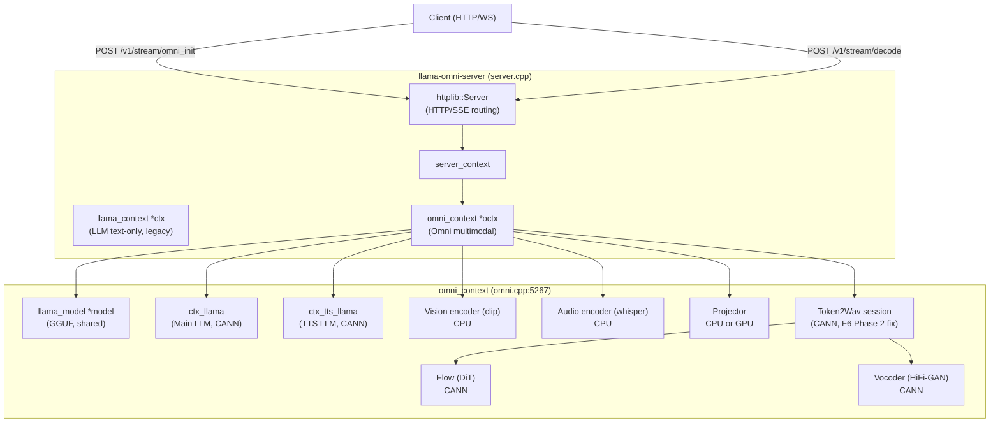
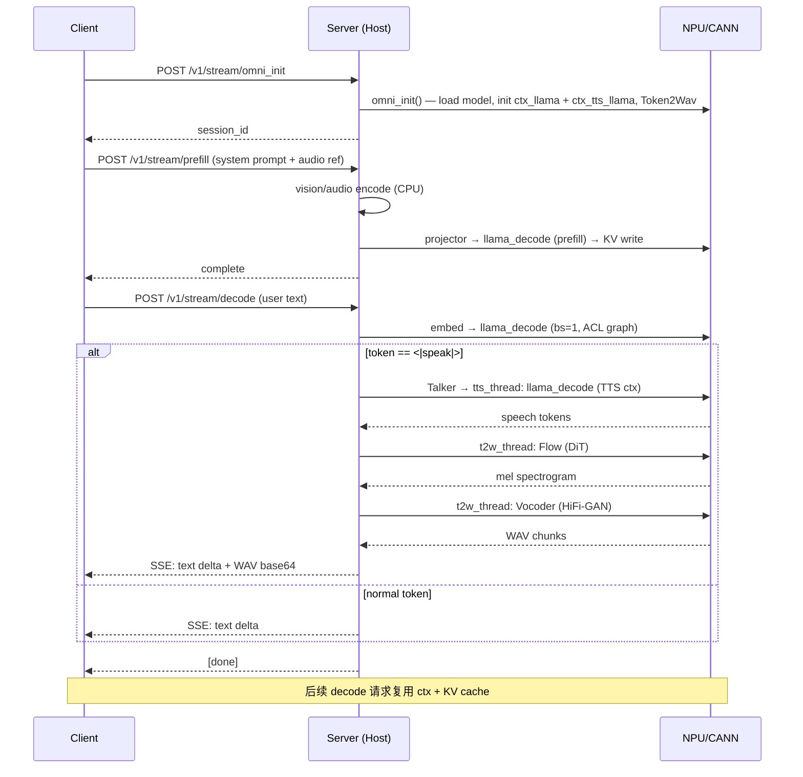
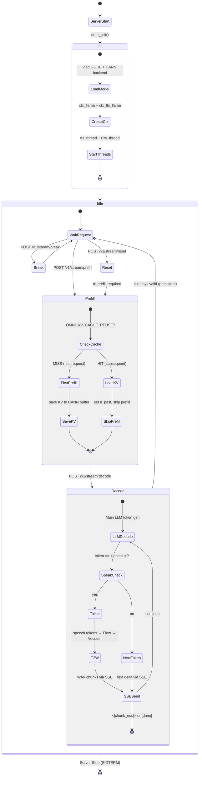

# F6 全模态链路架构

> **候选源码**: `bdd4550` | **状态**: `FINAL_INTERNAL`
> 本文档描述 llama.cpp-omni 在 MiniCPM-o 4.5 + Ascend 910C + CANN 9.1.0-beta.1 下的完整架构。

---

## 1. 总体架构

```
┌──────────────────────────────────────────────────────────────────────┐
│                          Client (HTTP/WS)                             │
└─────────────┬────────────────────────────────────────┬───────────────┘
              │ POST /v1/stream/omni_init              │ POST /v1/stream/decode
              │ (media_type, use_tts, duplex_mode)     │ (text/audio chunks)
              ▼                                        ▼
┌──────────────────────────────────────────────────────────────────────┐
│  llama-omni-server (server.cpp)                                      │
│                                                                      │
│  server_context                                                      │
│  ├── llama_context *ctx    ←─ LLM text-only context (legacy)         │
│  ├── omni_context *octx    ←─ Omni multimodal context                │
│  └── httplib::Server       ←─ HTTP/SSE routing                       │
└──────────────────────────────────────────────────────────────────────┘
                              │
                              ▼ omni_init()
┌──────────────────────────────────────────────────────────────────────┐
│  omni_context (omni.cpp:5267)                                        │
│                                                                      │
│  Model Loading & Context Creation:                                   │
│  ├── llama_model *model                    ←─ GGUF (shared across ctx)│
│  ├── llama_context *ctx_llama              ←─ Main LLM (CANN)        │
│  ├── llama_context *ctx_tts_llama          ←─ TTS LLM (CANN)         │
│  ├── Vision encoder (clip)                 ←─ CPU                    │
│  ├── Audio encoder (whisper)               ←─ CPU                    │
│  ├── Projector (vision→LLM embedding)      ←─ CPU or GPU             │
│  └── Token2Wav session                     ←─ CANN (F6 Phase 2 fix)  │
│       ├── Flow (DiT transformer)           ←─ CANN                   │
│       └── Vocoder (HiFi-GAN hifigan2.gguf) ←─ CANN                   │
└──────────────────────────────────────────────────────────────────────┘
```



---

## 2. 组件表

| 组件 | C++ 类型 | 源码文件 | 行号 | 设备 | 说明 |
|------|---------|---------|------|------|------|
| **HTTP Server** | `server_context` | `tools/server/server.cpp` | 2327 | Host | httplib HTTP/SSE + route registration |
| **Omni Context** | `omni_context` | `tools/omni/omni.h` | — | — | 全模态容器，持有所有子模型 |
| **omni_init** | 函数 | `tools/omni/omni.cpp` | 5267 | — | 模型加载、线程启动、KV cache 初始化 |
| **Main LLM** | `llama_context` | `src/llama-context.cpp` | — | **CANN** | 因果 LM decode (MiniCPM-o backbone) |
| **TTS LLM** | `llama_context` | `src/llama-context.cpp` | — | **CANN** | TTS 专用 decode (talker token generation) |
| **KV Cache (Main)** | `llama_kv_cache` | `src/llama-kv-cache.cpp` | 104-192 | **CANN** (K/V tensors) / CPU (metadata) | `offload_kqv=true` 时 K/V 在 CANN |
| **KV Cache (TTS)** | `llama_kv_cache` | `src/llama-kv-cache.cpp` | 104-192 | **CANN** (K/V tensors) / CPU (metadata) | TTS 独立 KV，TTL 与请求绑定 |
| **Vision Encoder** | `clip_ctx` | `examples/llava/clip.cpp` | — | CPU | 图像 → patch embeddings |
| **Audio Encoder** | `whisper_context` | (whisper.cpp) | — | CPU | 音频 → mel spectrogram features |
| **Projector** | `mmproj` | `tools/omni/omni.cpp` | — | CPU/GPU | 视觉 embedding → LLM hidden dim 投影 |
| **Flow Model** | `flowGGUFModelLoader` | `tools/omni/token2wav/token2wav-impl.cpp` | 7465 | **CANN** | DiT transformer: token → mel spectrogram |
| **Vocoder** | `voc_hg2_runner` | `tools/omni/token2wav/token2wav-impl.cpp` | 6880 | **CANN** | HiFi-GAN: mel spectrogram → waveform |
| **Talker** | Stage (`STAGE_talker_*`) | `tools/omni/omni.h` | 351-353 | **CANN** | `<|speak|>` 触发 → TTS token → token2wav queue; 复用主 LLM KV cache |
| **Sampler** | `common_sampler` | `common/sampling.cpp` | — | CPU | Token selection (temperature/top-p/top-k) |
| **Tokenizer** | `llama_tokenize` | `src/llama.cpp` | — | CPU | Text tokenization / detokenization |
| **T2W Queue** | `t2w_queue` | `tools/omni/omni.cpp` | — | Inter-thread | speech token → Flow/Vocoder 流水线 |
| **WAV Writer** | — | `tools/omni/omni.cpp` | — | Host | 16-bit PCM @24kHz → WAV file / HTTP chunk |

---

## 3. 单请求序列

```
Time ──────────────────────────────────────────────────────────────────►

   Client                Server                         NPU / CANN
     │                     │                                │
     │── POST omni_init ──►│                                │
     │                     │── omni_init() ──────────────────►│ 加载模型
     │                     │   ctx_llama (CANN)              │ KV 初始化
     │                     │   ctx_tts_llama (CANN)          │
     │                     │   Token2Wav session (CANN)      │
     │◄── session_id ──────│                                │
     │                     │                                │
     │── POST prefill ────►│                                │
     │   (system prompt    │── omni_prefill() ───────────────►│ Embed + Prefill
     │    + audio ref)     │   vision/audio encode (CPU)     │ KV write (CANN)
     │                     │   projector ────────────────────►│
     │                     │   llama_decode (prefill)        │
     │◄── complete ────────│                                │
     │                     │                                │
     │── POST decode ─────►│                                │
     │   (user text/audio) │── omni_decode() ────────────────►│
     │                     │   embed user input ─────────────►│
     │                     │   llama_decode (decode, bs=1)   │ ACL graph capture
     │                     │   sample token                  │
     │                     │   if token == <|speak|>:        │
     │                     │     ┌─ Talker stage start       │
     │                     │     ├─ tts_thread:              │
     │                     │     │   llama_decode (TTS ctx)  │ TTS KV (CANN)
     │                     │     │   → speech tokens         │
     │                     │     ├─ t2w_thread:              │
     │                     │     │   Flow(DiT) ──────────────►│ CANN compute
     │                     │     │   Vocoder(HiFi-GAN) ──────►│ CANN compute
     │                     │     │   → WAV chunks            │
     │◄── SSE: text + WAV ─┤     │                           │
     │                     │     └─ until <|chunk_eos|>      │
     │◄── [done] ──────────┤                                │
     │                     │                                │
     │── POST decode ─────►│  (后续请求复用 ctx + KV)        │
     │   ...               │   ...                          │
```



### Key timing points (单请求内):
- `W0` (First Audio): HTTP request arrival → 首个 WAV chunk 写入完成的墙上时钟
- Prefill: prompt embedding + `llama_decode` (prefill phase, batch > 1)
- Decode: 单 token `llama_decode` (decode phase, bs=1)
- T2W: speech token submission → WAV chunk output (Flow + Vocoder)

---

## 4. Persistent Server 生命周期

```
Server Start
    │
    ▼
omni_init()  ◄── 一次性：加载模型、初始化 ctx、启动线程
    │
    ▼
┌─────────────────────────────────────────────────────────────────┐
│  Idle: 等待请求                                                   │
│                                                                  │
│  POST /v1/stream/prefill                                        │
│    ├── 新 session 或 reuse session                              │
│    ├── 如果 OMNI_KV_CACHE_REUSE=1:                               │
│    │   ├── 首次: prefill → save KV to CANN buffer (static prefix)│
│    │   └── 后续: load KV → skip prefill → 仅 decode              │
│    └── Prefill 完成 → 等待 decode                               │
│                                                                  │
│  POST /v1/stream/decode                                         │
│    ├── 复用同一 ctx_llama + ctx_tts_llama                         │
│    ├── Token generation loop (Main LLM → Talker → T2W)          │
│    ├── SSE 流式: text delta + WAV chunks                        │
│    └── 完成后 ctx 保持 valid (persistent lifecycle)              │
│                                                                  │
│  POST /v1/stream/break  (中断当前生成)                            │
│  POST /v1/stream/reset  (重置 session)                           │
└─────────────────────────────────────────────────────────────────┘
    │
    ▼
Server Stop (SIGTERM)
```



**关键修复 (F6)**:
- Drain timeout: 修复后不再错误触发
- Cross-request contamination (R7/R9): verify 0 contamination
- ctx validity across requests: 3 sequential decode requests all PASS

---

## 5. CANN Backend 层次

```
ggml_backend_cann (ggml-cann.cpp)
├── caps: { .async = false, .events = true }
│     └── CANN 9.1.0-beta.1 无通用异步计算流水，但有 event 支持
│
├── supports_op() (line 2528-2828)
│     ├── ~60 ops supported
│     ├── FLASH_ATTN_EXT: 仅 F16 Q/K/V (双重 dtype 检查 bug)
│     ├── ROPE: ne[0] <= 896
│     ├── SOFT_MAX: 不支持 attention sinks
│     └── SCALE: bias=0 only
│
├── offload_op() (line 3001-3004)
│     └── return ne[1] >= op_offload_min_batch_size (default 32)
│           && op != GGML_OP_GET_ROWS
│     └── decode bs=1 时始终返回 false（但不影响 -ngl 999）
│
├── buffer_set_tensor (line 1330-1404)
│     └── sync aclrtMemcpy (H2D)
│
├── set_tensor_async (line 2181-2194)
│     └── async aclrtMemcpyAsync (H2D)
│
├── get_tensor_async (line 2207-2221)
│     └── async aclrtMemcpyAsync (D2H)
│
├── cpy_tensor_async (line 2235-2300)
│     └── cross-device D2D + SynchronizeStream
│
├── synchronize() (line 2310-2314)
│     └── aclrtSynchronizeStream
│
└── graph_compute (line 2365-2514)
      ├── ACL graph mode: decode only (seq_len=1), min_nodes=100
      └── LRU cache for graph capture reuse
```

详见 `docs/audit/CANN_CPU_NPU_PLACEMENT_AUDIT.md` 和 `docs/audit/CANN_SUPPORTS_OP_MATRIX.md`。

---

## 6. 设备放置决策树

```
Scheduler 5-pass (ggml-backend.cpp:900-970):
  Pass 1.wgt:  weight tensor 在 CANN → op 在 CANN (via ggml_backend_cann)
  Pass 1.off:  weight 在 CPU + supports_op + offload_op(ne[1]>=32) → offload
  Pass 2:      dst/vsrc 继承上一 op 的 backend
  Pass 3:      upgrade (CPU→GPU if connected outputs)
  Pass 4:      fallback (unsupported op → CPU)
  Pass 5:      split (heterogeneous graph → sync/copy between splits)

-ngl 999 的效果:
  所有可卸载 weight tensor → CANN buffer
  Pass 1.wgt 使 decoder layers 的全部 op 在 CANN
  Pass 1.off 不触发 (decode bs=1 < 32)

但以下仍在 CPU/Host:
  - Input tensors (token embedding 输入, GGML_TENSOR_FLAG_INPUT)
  - Index tensors (GET_ROWS 的索引)
  - KV cache metadata (ggml_backend_cpu_buffer_type)
  - D2H logits/hidden states (get_tensor_async)
  - Sampler, Tokenizer, HTTP response assembly
```

---

## 7. 线程模型

```
Main Thread (server)
  ├── HTTP handler threads (httplib thread pool)
  │     └── omni_init / prefill / decode / break / reset
  │
  ├── Duplex mode:
  │     ├── duplex_encoder_thread_func   ← audio encoder loop
  │     └── duplex_llm_thread_func       ← LLM decode loop
  │
  ├── Simplex mode:
  │     └── llm_thread_func              ← LLM decode loop
  │
  ├── TTS thread:
  │     ├── tts_thread_func_duplex       ← duplex TTS thread
  │     └── tts_thread_func (simplex)    ← simplex TTS thread
  │
  └── T2W thread:
        └── t2w_thread_func              ← Flow + Vocoder pipeline
              ├── Flow (DiT) on CANN
              └── Vocoder (HiFi-GAN) on CANN
```

**同步机制**:
- `mutex_wait`: thread lock + condition variable wait (queue contention) — p50=0ms
- `aclrtSynchronizeStream`: Host waiting for CANN stream completion — NOT_MEASURED on frozen candidate

---

## 8. KV Cache 架构

```
llama_context
├── ctx_llama (Main LLM)
│     └── llama_kv_cache
│           ├── K/V tensors: CANN buffer (when offload_kqv=true)
│           ├── cell metadata: CPU (ggml_backend_cpu_buffer_type)
│           ├── n_ctx = 4096 (default)
│           └── Static prefix: save/load via OMNI_KV_CACHE_REUSE=1
│
└── ctx_tts_llama (TTS LLM)
      └── llama_kv_cache
            ├── K/V tensors: CANN buffer
            ├── cell metadata: CPU
            ├── n_ctx = 4096
            └── Reset per request (via TTS KV bounds guard, T13 PASS)
```

**Static Prefix KV Cache 流程**:
```
首次请求 (MISS):
  prefill (system prompt + reference audio) → llama_decode (prefill)
  → walk KV cache → save K/V to CANN buffer
  → 耗时 p50=206ms

后续请求 (HIT) — OMNI_KV_CACHE_REUSE=1:
  load K/V from CANN buffer → set n_past to prefix_len
  → skip prefill → 仅 decode (用户输入部分)
  → 耗时 p50=85ms (2.4× speedup)
```

---

## 9. T2W (Token-to-Waveform) 流水线

```
speech tokens (from TTS thread)
    │
    ▼
┌─────────────────┐
│ Flow (DiT)      │ ← CANN (when OMNI_T2W_DEVICE=cann-flow-only)
│ token→mel       │   token2wav-impl.cpp:7465 init_backend()
└────────┬────────┘
         │ mel spectrogram
         ▼
┌─────────────────┐
│ Vocoder         │ ← CANN (when OMNI_VOC_DEVICE=gpu)
│ (HiFi-GAN)      │   token2wav-impl.cpp:6880 voc_hg2_runner_eval_stream
│ mel→WAV         │   dispatch: is_cann_backend check → CANN vs CPU path
└────────┬────────┘
         │ 16-bit PCM @24kHz
         ▼
    WAV chunk → HTTP SSE response
```

**F6 关键修正**: 原始代码 T2W 默认走 `ggml_backend_cpu_buffer_type()`。通过 env-only 开关（零代码修改）将 Flow + Vocoder 都调度到 CANN。

---

## 10. 配置开关速查

| 开关 | 类型 | 作用 | 默认值 |
|------|------|------|--------|
| `-ngl 999` | CLI | 模型 weight 全部放 CANN | 0 (CPU) |
| `OMNI_T2W_DEVICE=cann-flow-only` | env | Flow 模型强制 CANN | `gpu` |
| `OMNI_VOC_DEVICE=gpu` | env | Vocoder 强制 CANN | `cpu` |
| `OMNI_KV_CACHE_REUSE=1` | env | 静态 prefix KV cache 复用 | OFF |
| `OMNI_VOC_PATH_STATS=1` | env | Vocoder CANN/CPU dispatch 计数 | OFF |
| `F6_PHASE3_TALKER_STATS=1` | env | Talker per-step profiling | OFF |
| `--split-mode layer` | CLI | Backend 分配策略 | `layer` |
| `-fa off` | CLI | Flash Attention 关闭 | `on` |
| `-c 4096` | CLI | Context 长度 | 512 |

---

## 11. 官方评测链路 (NOT_RUN)

```
submission/scripts/run_daily_omni.sh ──► 官方 Daily-Omni harness
submission/scripts/run_tts_seed.sh   ──► 官方 TTS-Seed harness
submission/scripts/run_video_mme.sh  ──► 官方 Video-MME harness
submission/scripts/run_demo.sh       ──► 官方 Demo 前端
submission/scripts/run_performance.sh ──► chunk RTF 采集
```

全部 `BLOCKED_BY_OFFICIAL_STARTER_KIT`。内部工具链 ready：`selftest 14/14`、`Gate --dry-run`、`valid_audio`、`check_baseline_candidate_symmetry.py`。

---

## 12. 构建产物

| 产物 | 目标 | 类型 |
|------|------|------|
| `build/bin/llama-omni-server` | `cmake --build build --target llama-omni-server` | 动态链接可执行文件 |
| `build/src/libllama.so` | `cmake --build build --target llama` | 共享库 |
| `build/src/libggml.so` | `cmake --build build --target ggml` | 共享库 |
| `build/tools/omni/libomni.so` | `cmake --build build --target omni` | 共享库 |

冻结 binary SHA（两次干净重建确认一致）:
- `llama-omni-server`: `db258375c3d2185ca2181da2a5c8f99a95d381413fcb7ab92a771850ba3a4a21`
- `libomni.so`: `c4b169376bced6bc3107cfda2f77abf35a634c1e146eed313a193e99e3739ea1`
