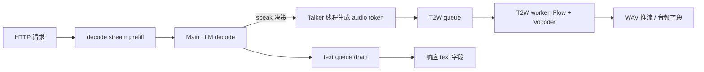
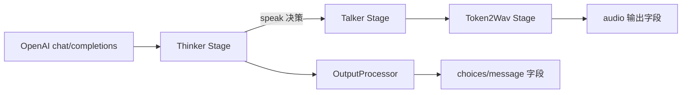
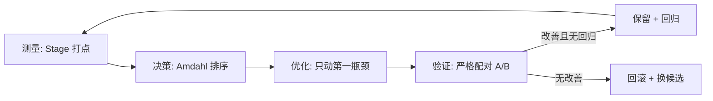

# 从 llama.cpp-omni 到 vLLM-Omni：MiniCPM-o 4.5 昇腾优化经验迁移指南

> **一句话定位**：本文把 llama.cpp-omni 在 Ascend 910C（CANN）上踩过的所有坑和验证过的方法，整理成一份**在 vLLM-Omni 上可以照着执行的迁移清单**。
> **硬性口径**：llama 侧数字只作假设与参考标尺，**不是 vLLM 结果**；vLLM 侧任何未源码核实的内容一律标 `TO_AUDIT`。内部结果 ≠ 官方结果。
> **配套文档**：入口 README → 本指南（主文）→ 组件映射（代码地图）→ 原始证据附录（数字）→ 执行计划（V0–V12）→ 风险矩阵（25 风险）→ 交接包（队友第一周）。

---

## 0. 为什么会有这份指南（目的与背景）

我们在 llama.cpp-omni（`MiniCPM-o-4_5` 多模态 omni 模型，Ascend 910C dual-die，CANN 9.1.0-beta.1）上完成了从 0 到比赛交付的全部优化与稳定性验证。期间我们反复验证过一个事实：**这条路上 80% 的坑与"模型好不好"无关，而与"异步流水线的生命周期、设备放置、接口协议、完成语义"有关**。这些坑换到 vLLM-Omni（官方多 Stage pipeline：Thinker→Talker→Token2Wav）上大概率还会再出现。

因此本指南的每一节不是"复述 llama 怎么调"，而是回答六个可执行问题：

1. **为什么查**：这个经验在 vLLM 上意味着什么，不查的代价是什么。
2. **从哪里查**：vLLM 源码 / 部署文档 / 运行时日志的具体入口。
3. **怎么证明**：最小实验设计，配对 A/B 的严格口径。
4. **看到不同结果分别怎么决策**：每个分支给结论。
5. **哪些现象容易误判**：llama 路上真实踩过的误判清单。
6. **最后应留下什么证据**：交付时数据文件、文档、状态标签。

> 术语速查：TTFT=首 token；audio TTFP=首个音频 token；RTF=实时率（合成时长/音频时长）；W0=首个有效语音 token 延迟；T2W=Token2Wav；KV Cache=键值缓存；APC=Automatic Prefix Caching。

---

## 1. 请求路径全景（llama 侧怎么流转 → vLLM 侧怎么映射）

### 1.1 llama.cpp-omni 请求路径



关键事实（llama 侧已验证）：

- **两个独立上下文**：Main LLM KV 常驻可复用（Persistent Server）；**TTS 有独立 KV context，上限 4096**（`tts_n_past_accumulated`），每请求 chunk 0 时重置。
- **两个异步队列**：Talker 产 audio token → T2W queue；主链路产文本 → text queue。**出队 ≠ 处理完成**（R7 教训）。
- **完成语义**：响应返回 ≠ 全部 Stage 完成；断连需要"在途 decode 平息"后才复用常驻上下文。

### 1.2 vLLM-Omni 请求路径（TO_AUDIT）



（映射来源：`LLAMA_VLLM_COMPONENT_MAPPING.md`。类名/函数名均为候选，未源码核实 → `TO_AUDIT`。）

**迁移问题清单（每个都要在 vLLM 侧回答）**：

| llama 事实 | vLLM 必答 |
|---|---|
| TTS 独立 KV 4096 | Talker / Token2Wav 是否有独立 context？上限多少？ |
| 常驻前缀复用 | Prefix Cache 是否覆盖多模态 / 参考音频 / TTS template？ |
| 出队 ≠ 完成 | Stage queue empty 是否 = 无 active work？ |
| 断连后恢复 | abort 后谁取消下游 Stage？是否留 orphan task？ |
| 接口字段完整性 | 非流式 text + audio 字段是否都在？ |

---

## 2. 方法论：先测量，后优化（llama 路线图）



这条闭环在 llama 上的产出：

1. **打点推翻假设**：原以为 LLM decode 是首音瓶颈 → 实测 decode→speak 只占端到端 **~2.9%**，T2W（Flow/Vocoder）占 **~93%**。
2. **Amdahl 排序决定优先级**：先优化占 93% 的设备放置，收益最大（W0 −81.4%）；decode 相关优化一律 REJECT_BY_AMDAHL。
3. **严格配对 A/B**：所有结论都要求同服务、同模型、同输入、同采样、配对统计 + CI95。30/30、32/32、19/19 这种"样本数/通过数"是标配。
4. **负结果也是结论**：B6b（提前触发 Talker）无稳定收益 → 记录并拒绝，防止他人重复踩。

> vLLM 侧第一步永远是 **V3 Stage 打点**（见执行计划），拿到 vLLM 自己的占比表，再谈优化。

---

## 3. 十二个核心经验（每条 10 点，可执行）

> 每条经验统一 10 点：①背景 ②原始现象 ③llama 证据与结论 ④为什么查 ⑤从哪里查 ⑥怎么证明 ⑦分支决策 ⑧易误判点 ⑨应留证据 ⑩优先级与阶段。

### 3.1 静态前缀 KV Cache 复用（Prefix Cache）

1. **背景**：每次请求都重复 prefill 相同的 system prompt / 参考音频 / TTS template，浪费首 token 时间。
2. **原始现象**：llama prefill 每请求重复；Persistent Server 化之后前缀可常驻。
3. **llama 证据与结论**：prefill 206→85ms（2.4× / 58.7%），复验 210→86ms（2.5×）、201.7→83.1ms（2.43×）。30/30 严格配对。**注意：收益仅限 prefill 阶段，不是端到端**。
4. **为什么查**：vLLM 有 Prefix Caching，但**覆盖范围未验证**——是否缓存多模态 embedding、参考音频、TTS template 的 KV？只缓存 thinker 文本 KV 则对 omni 意义有限。
5. **从哪里查**：`vllm/worker/cache_engine.py`、`block_manager.py`；`rg -n "prefix|PrefixCaching|cache_hit|reused_tokens"`；运行时日志看 `reused_tokens`。
6. **怎么证明**：V5 配对 A/B：同请求，清 KV（MISS）vs 同前缀（HIT），≥30 对，比较端到端 TTFT / audio TTFP（CI95 不跨 0）。检查 reused tokens 数、false HIT/collision。
7. **分支决策**：端到端改善→OPTIMIZE 并回归；仅 prefill 改善→评估摊销；无改善→审计 Cache Key 覆盖，很可能只缓存了 thinker 文本 KV。
8. **易误判**：把"命中缓存"当"端到端收益"；把 llama 2.4× 数字直接引用到 vLLM。
9. **应留证据**：`prefix_cache_ab.json`（含 reused tokens、TTFT/audio TTFP 配对、CI95）、Cache Key 审计结论。
10. **优先级**：P1；执行计划 **V5**。

### 3.2 先打点，推翻"decode 是瓶颈"假设

1. **背景**：首音慢时，直觉会归因模型 decode。
2. **原始现象**：W0 高（4.7s），怀疑是 LLM 解码慢。
3. **llama 证据与结论**：打点后 decode→speak 仅占端到端 **~2.9%**，T2W 占 **~93%**。瓶颈在语音合成链，不在模型解码。
4. **为什么查**：vLLM 若直接优化 thinker decode，大概率白费（且是 QUALITY_RISK）。
5. **从哪里查**：每 Stage 首尾埋 monotonic 时间戳（T0–T15 事件见 §9.1）；`rg -n "audio_ttfp|audio_rtf|first.*audio"`；profiler 验收（kernel_details 47 列）。
6. **怎么证明**：V3 跑 ≥10 次 TTS 请求，算各段 p50/p90/p95、占比、Amdahl 上限。单段 >50% 即锁定第一候选。
7. **分支决策**：T2W/Flow/Vocoder 占比高→查设备放置；Thinker prefill 高→查 Prefix Cache；queue wait 高→查调度参数。
8. **易误判**：只看 `npu-smi` 利用率（无法识别 CPU 回退）；把 profiler 解析失败当代码问题（多为输出目录文件系统，换盘即可）。
9. **应留证据**：`stage_timeline.json` + 占比表 + Amdahl 排序 + 结论（哪个假设被推翻）。
10. **优先级**：**P0**；执行计划 **V3**。

### 3.3 设备放置 > 模型 decode（Flow/Vocoder 跑 CPU 是大坑）

1. **背景**：语音合成算子可以跑 CPU 也可以跑 NPU，配置不同天壤之别。
2. **原始现象**：W0 p50 4798ms，怀疑模型慢。
3. **llama 证据与结论**：T2W 从 CPU 迁到 NPU（CANN Flow+Vocoder），W0 4798→894ms（**−81.4%**），32/32 配对，CI95 [−4220,−3732]；T4 严格复核 19/19 全负（排除 LLM 随机 preamble），T2W-only p50 −4215.8ms。
4. **为什么查**：vLLM 的 Token2Wav/Flow/Vocoder 设备放置**未审计**——可能仍在 CPU，或 host-device copy 主导首音。
5. **从哪里查**：逐 Stage 打 `tensor.device`；`rg -n "Flow|Vocoder|HiFT|HiFiGAN|step_audio2_core"`；`npu-smi` + msprof 算子归属。
6. **怎么证明**：V4 设备放置审计 → V8 单因素 A/B（前后同口径配对 ≥10 对）。
7. **分支决策**：Flow/Vocoder 在 CPU→评估迁 NPU（先算子支持审计）；已在 NPU 仍慢→查同步/shape/host copy；占首音 <5%→REJECT_BY_AMDAHL。
8. **易误判**：配置声明 NPU 但实际算子落 CPU；把 copy 时间当算子时间；多卡结果当单卡成绩。
9. **应留证据**：`device_placement.md`（逐 Stage 设备 + copy 位置）+ 迁移前后 A/B 数据。
10. **优先级**：**P0**；执行计划 **V4 / V8**。

### 3.4 出队 ≠ 完成（drain / 完成语义）

1. **背景**：异步 Stage 的"队列空"不代表"处理完成"。
2. **原始现象**：queue 空误判完成，导致上下文复用竞争、音频被截断。
3. **llama 证据与结论**：R7 drain 审计证明 dequeue ≠ Flow/Vocoder processed；happens-before 证明 + T4 证据。
4. **为什么查**：vLLM Stage channel / future 的完成语义必须精确，否则响应返回后仍有 active work（HBM 占用、旧音频混入）。
5. **从哪里查**：Stage 间传输实现；`rg -n "Queue|channel|put_nowait|get_nowait|async for"`。
6. **怎么证明**：V6 response 后查 orphan work / 残留 future；V3 同时打 active work 与 queue depth。
7. **分支决策**：response 后仍有 active work→修完成语义；无残留→完成语义 OK。
8. **易误判**：把"响应返回"当"处理完成"；把 queue empty 当 idle。
9. **应留证据**：完成语义审计 + 残留任务计数。
10. **优先级**：P1；执行计划 **V3 / V6**。

### 3.5 状态绑定请求身份（per-request / per-generation 隔离）

1. **背景**：全局布尔量、共享状态会被并发/复用请求污染。
2. **原始现象**：旧请求的回调写到新请求的 state，跨请求污染、唤醒错请求。
3. **llama 证据与结论**：F6 R5 / C6 / C7：状态必须绑定请求身份；per-generation queued/active 隔离（active==0 || active>N 判据）3/3 PASS。
4. **为什么查**：vLLM request state 是否 per-request 贯穿 thinker→talker→token2wav？取消/断连后状态是否复位？
5. **从哪里查**：`rg -n "request_id|abort|cancel|finish"`；检查 request identity 是否贯穿所有 Stage 与回调。
6. **怎么证明**：V6 连续 20/20 不同请求 + 断连/取消注入，检查回调是否写已复用 state。
7. **分支决策**：旧输出混入新请求→request identity 绑定缺陷；无混入→OK。
8. **易误判**：偶发错误归因"偶发"而非"状态复用"。
9. **应留证据**：`lifecycle.json` + 失败样本（含 request_id 时间线）。
10. **优先级**：P1；执行计划 **V6**。

### 3.6 接口/协议先于模型（先验输入 packing 与输出字段）

1. **背景**：接口缺陷会被误判为"模型不支持"。
2. **原始现象**：非流式响应无 text 字段、SSE 崩溃 → 误判模型不能判分；输入协议错误 → prefill 吞内容 → 误判准确率低。
3. **llama 证据与结论**：T7/T9：输出接口缺陷（无 text、SSE bad_alloc）直接阻塞官方准确率；修正后正常。
4. **为什么查**：vLLM `/v1/chat/completions` 的 streaming/non-streaming 字段完整性、TTS 模板开关透传、Daily-Omni packing 都需先验。
5. **从哪里查**：OutputProcessor / chat 响应构造；`rg -n "audio|choices|message.content|finish_reason"`；Daily-Omni `--interleave-mm-strings --daily-omni-pack-mode minicpm-interleave`。
6. **怎么证明**：V1 三类请求 × streaming/non-streaming 冒烟，断言字段完整；V10 先验 packing token 数再判分。
7. **分支决策**：缺 text/audio→查 output processor；崩溃→查 streaming 终结语义；packing 错→假低精度，先修协议。
8. **易误判**：把接口缺陷当模型能力；把 packing 错误当模型答错。
9. **应留证据**：冒烟脚本 + 三份请求/响应样例 + 字段断言结果。
10. **优先级**：P1；执行计划 **V1 / V10**。

### 3.7 Talker 有独立 context 上限（memory-slot 提前测）

1. **背景**：TTS 音频 token 生成的 KV 与主模型不同，有独立上限。
2. **原始现象**：长 TTS 撞顶：`decode: failed to find a memory slot`，单请求累积 3815 个 TTS token 撞 4096 上限 → HTTP 500 + 堆损坏。
3. **llama 证据与结论**：`tts_n_past_accumulated`=4096；修复为 bounds guard（`n_past+batch > llama_n_ctx` 提前截断）。**是非跨请求的"单请求内溢出"**。
4. **为什么查**：vLLM Talker KV / Token2Wav buffer / Block Manager 哪一级先满？不能把 memory-slot 类错误全归因主模型 KV。
5. **从哪里查**：每 Stage `max_num_batched_tokens` / `max_num_seqs` / buffer 上限；V7 分 Stage 监控 context usage。
6. **怎么证明**：V7 长 TTS 分 Stage 监控，找出先满的一级；验证优雅截断或明确报错。
7. **分支决策**：Talker KV 满→调 max_num_* 或截断策略；Token2Wav buffer 满→背压；block manager 满→容量。
8. **易误判**：把所有 memory-slot 错误归因主模型 KV；把单请求溢出当跨请求污染。
9. **应留证据**：`tts_long_ctx.json` + 分 Stage 诊断矩阵。
10. **优先级**：P1；执行计划 **V7**。

### 3.8 连续请求生命周期（Persistent Server 常驻上下文）

1. **背景**：比赛/评测是连续请求，不能每个请求重建前缀。
2. **原始现象**：每请求重建前缀 → prefill 重复。
3. **llama 证据与结论**：Persistent Server + KV 指纹复用：R13 Canonical 30/30；连续 3 次 decode 请求 ctx 保持有效；drain 超时修复。
4. **为什么查**：vLLM serving 常驻 + KV cache 连续请求是否状态隔离、HBM 是否随请求增长（leak）。
5. **从哪里查**：serving 常驻逻辑 + KV 回收；V6 连续 20/20 + HBM/RSS 监控。
6. **怎么证明**：V6 长稳；检查 HBM/RSS 基线与 KV block 回收。
7. **分支决策**：HBM 涨→leak，查 block/队列回收；正常→生命周期 OK。
8. **易误判**：把缓存增长当 leak；把旧进程占端口当新版本回归。
9. **应留证据**：`lifecycle.json` + HBM/RSS 曲线。
10. **优先级**：P1；执行计划 **V6**。

### 3.9 故障注入必须做（断连 / 取消 / 重启）

1. **背景**：崩溃往往在断连、取消、重启时发生，正常路径测不出来。
2. **原始现象**：客户端断连 → server 崩溃 / use-after-free。
3. **llama 证据与结论**：T6 Disconnect 5/5 修复（断连后存活 + followup OK）；弃用 recovery `omni_free` 竞争路径。
4. **为什么查**：vLLM abort/cancel 后是否留 orphan task、是否污染后续请求。
5. **从哪里查**：`rg -n "abort|cancel|disconnect"`；abort 路径 + Stage 后台任务。
6. **怎么证明**：V6 注入断连/取消，检查残留任务、1 请求内恢复。
7. **分支决策**：断连后恢复→OK；崩溃/污染→修 abort 路径。
8. **易误判**：只测正常路径就当稳定。
9. **应留证据**：故障注入脚本 + 失败样本 + 恢复验证。
10. **优先级**：P2；执行计划 **V6**。

### 3.10 诚实口径纪律（内部 vs 官方）

1. **背景**：内部结果 ≠ 官方结果；官方 Harness/资产未定时不得宣称 PASS。
2. **原始现象**：报告混淆内部质量与官方成绩。
3. **llama 证据与结论**：T7/T8 官方 Gate 一律 NOT_CLAIMED 直到官方 Harness 通过。
4. **为什么查**：vLLM 侧同理，OFFICIAL_BENCHMARK_PASS / COMPETITION_COMPLETE 仅在官方 Harness 通过后置位。
5. **从哪里查**：状态分离清单（`VLLM_TEAM_HANDOFF.md` §7）。
6. **怎么证明**：每次报告核对状态标签。
7. **分支决策**：官方未跑→INTERNAL_* 标签；官方跑了→OFFICIAL_* 才可用。
8. **易误判**：把 Seed-TTS/Daily-Omni 内部跑分当官方成绩。
9. **应留证据**：状态分离清单 + 官方 Gate 判定记录。
10. **优先级**：**P0**；执行计划 **V12**。

### 3.11 负结果与回滚（不在关键路径的优化无效）

1. **背景**：直觉优化可能不在关键路径，做了也白做。
2. **原始现象**：提前 5 token 触发 TTS 期望降低首音，实际无稳定收益。
3. **llama 证据与结论**：B6b 负结果（verified 无稳定收益）→ 记录并拒绝；T2W 才是 93%。
4. **为什么查**：vLLM 类似直觉优化（如提前触发 Decode-to-Speak）默认 REJECT_BY_AMDAHL。
5. **从哪里查**：占比表（V3）确认候选在不在关键路径。
6. **怎么证明**：优化前后严格配对 A/B，端到端无改善即回滚。
7. **分支决策**：改善→保留并回归；无改善→回滚，按 Amdahl 选下一候选。
8. **易误判**：把阶段改善当端到端改善；把小样本噪声当收益。
9. **应留证据**：优化 diff + A/B 数据 + "已拒绝优化"清单。
10. **优先级**：P2；执行计划 **V8**。

### 3.12 环境与版本冻结（可复现性）

1. **背景**：没有冻结基线则一切优化无法归因。
2. **原始现象**：旧进程占端口、旧结果继承、二进制未 SHA 化 → 无法复现。
3. **llama 证据与结论**：每次回归记录 binary SHA + source HEAD + 启动命令 + run_id。
4. **为什么查**：vLLM 需冻结镜像 tag / 分支 HEAD / deploy YAML SHA / 模型 revision。
5. **从哪里查**：run manifest（`VLLM_TEAM_HANDOFF.md` §6）。
6. **怎么证明**：V0 冻结 + 冒烟；任何报告附 run manifest。
7. **分支决策**：可复现→继续；不可复现→回 V0。
8. **易误判**：把"旧进程结果"当"新版本结果"。
9. **应留证据**：`freeze.txt` + 启动命令 + 日志 + SHA 清单。
10. **优先级**：P3（操作）；执行计划 **V0 / V12**。

---

## 4. 四条决策树（何时用哪个实验）

### DT1 — 首音（audio TTFP）慢，先走哪步？

```text
首音慢
  ├─ 有 Stage 占比表吗?
  │    ├─ 无 → V3 打点（先测量）            ← 任何优化前必经
  │    └─ 有 → 看占比:
  │         ├─ T2W/Flow/Vocoder >50% → DT3 设备放置
  │         ├─ Thinker prefill 高 → DT2 前缀缓存
  │         ├─ queue wait 高 → V8 调度参数
  │         └─ decode >50% → 先复测（llama 仅 2.9%）
```

### DT2 — Prefix Cache 要不要做？

```text
启用 Prefix Caching
  ├─ 先回答 Cache Key 覆盖范围:
  │    ├─ 只覆盖 thinker 文本 KV → 对 omni 收益有限（TO_AUDIT）
  │    └─ 覆盖多模态/参考音频/模板 → 做 V5 A/B
  ├─ V5 A/B: 端到端 TTFT/audio TTFP 显著改善(CI95 不跨0)?
  │    ├─ 是 → OPTIMIZE + 回归
  │    ├─ 仅 prefill 改善 → 评估摊销
  │    └─ 无改善 → 检查 false HIT/collision, 修 key 语义
```

### DT3 — 设备放置要不要动？

```text
T2W/Flow/Vocoder 在哪跑?
  ├─ 审计 tensor.device + msprof 算子归属
  │    ├─ 在 CPU → 评估迁 NPU（先算子支持审计）→ V8 A/B
  │    ├─ 在 NPU 但仍慢 → 查 host-device copy / 同步 / shape
  │    └─ 占首音 <5% → REJECT_BY_AMDAHL，不动
```

### DT4 — 请求失败 / 500 / 崩溃，怎么归因？

```text
请求异常
  ├─ HTTP 错误 → 查 serving 层 + 异常 handler（有无静默 500）
  ├─ 旧输出混入 → request identity 绑定
  ├─ HBM/RSS 涨 → KV/block/queue leak
  ├─ memory-slot 类 → 分 Stage 定位（Talker/Token2Wav/BlockManager）
  ├─ 断连/取消后异常 → abort 路径 orphan task
  └─ 准确率异常低 → 先验 packing/interleave/媒体资产，最后才怀疑模型
```

---

## 5. 最核心的三项迁移（给 CC / 队友的 Prompt 摘要）

| 优先级 | 迁移项 | 一句话 | 对应阶段 |
|---|---|---|---|
| 1 | **Stage 打点** | 端到端 T0–T15 时间线，产出占比 + Amdahl 排序，推翻/确认"decode 是瓶颈" | V3 |
| 2 | **设备放置审计** | 确认 Flow/Vocoder/Token2Wav 真实设备与 host-device copy 位置 | V4 |
| 3 | **Prefix Cache A/B** | 验证固定参考音频/模板/多模态前缀是否真正复用（注意只缓存 thinker 文本 KV 的风险） | V5 |

> 三者共同点：**先测量，后优化**。

---

## 6. 迁移到 vLLM 的差异清单（llama 没有的东西）

| 差异 | llama | vLLM（TO_AUDIT） | 影响 |
|---|---|---|---|
| 多 Stage pipeline | 手工线程 + 队列 | Thinker/Talker/Token2Wav 官方 Stage | 打点需适配 Stage 边界 |
| KV 管理 | 手工 `llama_memory_seq_rm` | BlockSpaceManager + Prefix Caching | 复用机制不同，数字不可迁移 |
| 设备放置 | env 开关切换 | YAML Stage 布局 + 算子设备 | 审计方法不同（`deploy/*.yaml`） |
| 流式 | 自研 SSE | OpenAI streaming | 字段/终结语义需重验 |
| 官方 benchmark | 自建 Harness | Seed-TTS / Daily-Omni 官方资产 | 口径必须分离 |

---

## 7. 各文档的阅读顺序

1. **README.md** — 30 秒了解这套文档是什么、从哪里下手。
2. **本文 §0–§5** — 方法与十二经验，建立"先测量后优化"的心智。
3. **LLAMA_RAW_EVIDENCE_APPENDIX.md** — 需要具体数字/CI95/样本时查。
4. **LLAMA_VLLM_COMPONENT_MAPPING.md** — 需要定位 vLLM 源码时查（13 组件 × 13 字段 + rg 命令）。
5. **VLLM_OPTIMIZATION_EXECUTION_PLAN.md** — 动手时按 V0→V12 走。
6. **VLLM_RISK_AND_VALIDATION_MATRIX.md** — 遇到故障时按 25 风险对号入座。
7. **VLLM_TEAM_HANDOFF.md** — 队友第一周计划 + 最终交付清单。

---

## 8. 关键指标口径（llama 侧定义，vLLM 侧重测）

| 指标 | 定义 | 说明 |
|---|---|---|
| TTFT | 请求→首个文本 token | 文本首token |
| TPOT | 每个输出 token 时间 | 解码吞吐 |
| audio TTFP | 请求→首个音频 token | 音频链路首token |
| W0 | 首个有效语音 token 延迟 | 与 audio TTFP 近似 |
| audio RTF | 合成耗时/音频时长 | <1 表示实时快 |
| WER | 字错误率 | Seed-TTS 质量 |
| E2E | 请求→完整响应 | 含 TTS 生成 |

> 所有结论必须带：样本数 / 配对方式 / p50/p95 / CI95 / 来源路径。

---

## 9. 附录

### 9.1 T0–T15 打点事件（llama 侧 schema，vLLM 侧适配）

```text
T0  request received        T8  T2W worker admit
T1  prefill start           T9  Flow begin
T2  prefill end             T10 Flow end
T3  first text token        T11 Vocoder begin
T4  speak decision          T12 Vocoder end
T5  talker admit            T13 first audio (W0)
T6  talker first token      T14 all audio done
T7  talker complete         T15 response sent
```

每事件带 `request_id / stage_id / worker_id / pid / device / timestamp`。

### 9.2 实验模板索引

| 模板 | 文件 |
|---|---|
| Run Manifest | `VLLM_TEAM_HANDOFF.md` §6 |
| Per-request 记录 | `EXPERIMENT_TEMPLATES.md` §2 |
| 决策记录 | `EXPERIMENT_TEMPLATES.md` §3 |
| 配对 A/B 检查清单 | `EXPERIMENT_TEMPLATES.md` §4 |

### 9.3 质量检查（每次提交前）

```text
1. git diff --check（无空白错误）
2. 文档间链接存在（相对路径正确）
3. 文中引用的路径/文件真实存在
4. 状态标签只用：CONFIRMED_FROM_DEPLOY_DOC / TO_AUDIT_IN_SOURCE / TO_MEASURE_AT_RUNTIME / UNPROVEN
5. llama 数字永不直接当 vLLM 结果（标注来源）
```

---

## 10. 状态与演化

- **本指南是"假设集"**：每条经验在 vLLM 侧的验证结果将回填到风险矩阵与交接包。
- **状态标签**：`CONFIRMED_FROM_DEPLOY_DOC / TO_AUDIT_IN_SOURCE / TO_MEASURE_AT_RUNTIME / UNPROVEN`。
- **证据基准**：llama 数字见 `LLAMA_RAW_EVIDENCE_APPENDIX.md` §0（环境）与 A–I 各表。
